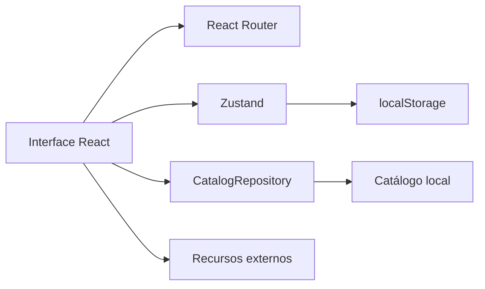
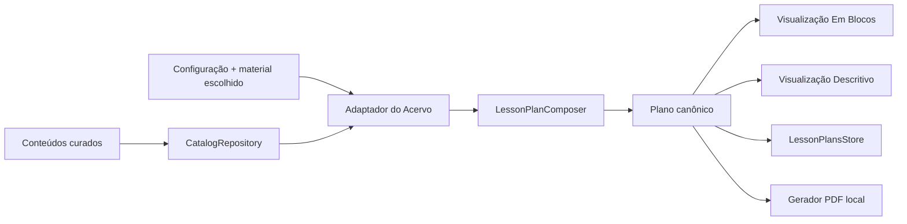

# Arquitetura do frontend

## Visão geral

O Informática Explorer é uma SPA estática construída com React, TypeScript e
Vite. A versão atual não depende de servidor próprio: o catálogo é uma fixture
local e o estado pessoal fica no navegador.



## Organização

```text
.
├── .github/workflows/       # validação e deploy automático
├── config/                  # Vite, Vitest, Playwright e ESLint
├── docs/                    # TCC, especificação e documentação técnica
├── public/                  # ativos servidos sem transformação pelo Vite
├── src/
│   ├── app/                 # composição de rotas
│   ├── components/          # componentes compartilhados
│   ├── data/                # catálogo inicial
│   ├── domain/              # tipos e regras de domínio
│   ├── features/            # funcionalidades por contexto
│   ├── lib/                 # utilitários puros
│   ├── repositories/        # limite de acesso ao catálogo
│   ├── store/               # sessão e biblioteca pessoal
│   ├── styles/              # tokens e estilos globais
│   └── test/                # configuração comum de testes
└── tests/e2e/               # fluxos reais no Playwright
```

Cada feature expõe sua API pública em `index.ts`. Componentes internos e
páginas permanecem dentro da própria feature para reduzir acoplamento.

## Decisões principais

### Rotas por hash

O `HashRouter` mantém o estado de navegação depois de `#`. Como o fragmento não
é enviado ao servidor, atualizar uma rota interna não depende de regras de
rewrite inexistentes no GitHub Pages.

### Caminho-base configurável

O Vite lê `VITE_BASE_PATH`. Localmente o valor padrão é `/`; no workflow ele é
`/<nome-do-repositorio>/`. O helper `publicAsset` aplica `BASE_URL` aos ativos
da pasta `public`, evitando links quebrados no Pages.

### Repositório de catálogo

A interface consome `CatalogRepository`, atualmente implementado por
`LocalCatalogRepository`. Um backend futuro poderá substituir essa classe sem
acoplar componentes ao transporte HTTP.

Os anos escolares aceitos pelo domínio são centralizados em
`SUPPORTED_GRADES` e reutilizados pelos filtros, pelo criador de planos e pela
validação do compositor. O recorte atual compreende do 4º ao 9º ano.

O currículo de um recurso é uma lista de alinhamentos explícitos. Cada item
associa **ano + eixo + objeto + habilidade + competências**, além da origem,
força, justificativa e estado do mapeamento. `recommendedGrades` representa os
anos em que o recurso pode ser aplicado, com base na indicação de público da
fonte ou em decisão curatorial explícita quando ela não informa anos, além de
extensões curatoriais registradas. Os anos podem ser mais amplos que
os alinhamentos: ao combinar Turma e Habilidade, o filtro ainda exige um
alinhamento que associe exatamente o ano ao código, evitando cruzamentos falsos.

O catálogo local é composto em `src/data/resources.mock.ts`. O registro do jogo
de cyberbullying da ALT+INOVARE permanece nesse agregador; as coleções ficam
separadas por origem ou finalidade em
`src/data/resources/unicampUnplugged.ts`,
`src/data/resources/programmingGames.ts`,
`src/data/resources/rozelmaTeachingMaterials.ts` e
`src/data/resources/digitalCitizenshipGames.ts`. Textos oficiais da BNCC e o
helper de criação dos alinhamentos ficam centralizados em
`src/data/bnccComputing.ts`.

As imagens licenciadas da Unicamp e de dois materiais de Rozelma ficam em
`public/images/cards/unicamp/` e `public/images/cards/rozelma/`; miniaturas
reduzidas ficam nas pastas correspondentes sob
`public/images/cards/thumbnails/` e são usadas na interface para evitar a
decodificação das imagens originais. Recursos sem permissão verificável para
reutilizar a imagem usam o placeholder do projeto. Materiais complementares
específicos continuam referenciados por links para a fonte original.

### Estado local

Zustand concentra sessão demonstrativa, favoritos, pastas e snapshots de
planos. Biblioteca pessoal e planos usam stores e chaves versionadas
independentes para reduzir colisões e permitir migrações no `localStorage`.

## Módulo de criação de planos

O módulo **Criar Plano de Aula** preserva a SPA estática e os limites atuais.
Acervo e criador são rotas independentes, mas compartilham o contrato de
catálogo. Depois de ano e habilidade, a tela apresenta os recursos alinhados e
envia somente o material escolhido ao compositor local.



Regras do limite:

- a configuração pública contém tema, ano escolar, habilidade, material do
  Acervo, objetivo, uma a três aulas, tipo de metodologia e opção de avaliação;
  não contém turma concreta, evidências, anotações ou objeto de conhecimento;
- o adaptador consulta o repositório, deriva as opções curriculares e injeta no
  compositor o candidato escolhido e sua proveniência;
- a elegibilidade usa o par exato ano–habilidade e uma URL HTTP(S) segura;
  duração, função, proposta e sugestão avaliativa não são filtros nesta fase;
- os três perfis metodológicos ficam disponíveis para candidatos elegíveis;
- o compositor pode reutilizar o mesmo conteúdo em uma, duas ou três aulas;
- o ID do conteúdo selecionado permanece na sessão e na avaliação como
  proveniência;
- ausência de base compatível retorna um resultado tipado de insuficiência, sem
  preenchimento genérico;
- cada aula tem 50 minutos. Sem avaliação, são 45 minutos de atividade central
  e cinco de margem; quando solicitada, a última aula usa 35 minutos de
  atividade, dez de avaliação e cinco de margem;
- os materiais permanecem associados à aula no domínio; a visualização Em Blocos
  os agrega em um bloco próprio e a descritiva os lista dentro de cada aula;
- um único objeto de plano alimenta a visualização Em Blocos em cinco blocos e a
  visualização descritiva organizada cronologicamente por aula;
- metodologia e avaliação usam constantes distintas de lorem ipsum até que os
  modelos pedagógicos sejam definidos com a orientação do TCC;
- `useLessonPlansStore` salva snapshots completos, valida hidratação, preserva
  identidade e datas na edição e nunca persiste HTML ou Blob;
- o gerador de PDF produz bytes A4 no navegador, com texto selecionável,
  paginação e download por URL temporária;
- não há backend, API de geração ou chamada a modelo de IA neste recorte.

Para sustentar a composição, o domínio de recurso contém **função pedagógica**,
**proposta de aplicação** e **sugestão de avaliação**. Eles permanecem opcionais
para representar metadados pendentes e não determinam elegibilidade enquanto
os textos visíveis forem provisórios. A tela e o compositor consomem o contrato
de repositório, nunca a fixture diretamente.

## Qualidade

- TypeScript em modo estrito para contratos e dados.
- ESLint para consistência e regras de React.
- Vitest e Testing Library para domínio, estado e componentes.
- Playwright em perfis desktop e mobile para fluxos completos.
- axe-core para detectar violações automáticas de acessibilidade.
- GitHub Actions bloqueia o deploy se alguma verificação falhar.

## Evolução prevista

Backend, identidade, autorização e persistência remota não devem ser
introduzidos diretamente nos componentes. IA está fora do recorte de criação
de planos; se for investigada no futuro, exigirá especificação própria. Toda
evolução deve preservar os limites de repositório, domínio e estado e registrar
novas decisões antes da implementação.
