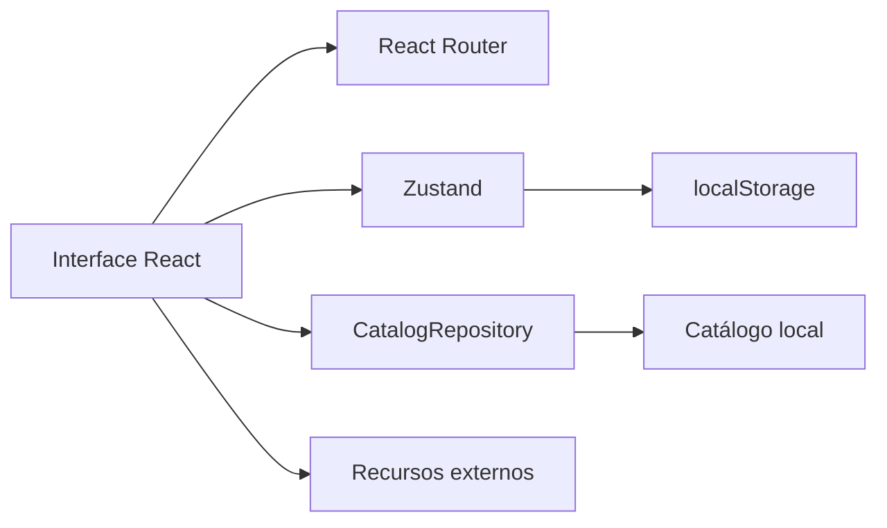

# Arquitetura do frontend

## Visão geral

O Informática Explorer é uma SPA estática construída com React, TypeScript e
Vite. A versão atual não depende de servidor próprio: o catálogo é uma fixture
local e o estado pessoal fica no navegador.



## Organização

```text
.
├── .github/workflows/       # validação e deploy automático
├── config/                  # Vite, Vitest, Playwright e ESLint
├── docs/                    # TCC, especificação e documentação técnica
├── public/                  # ativos servidos sem transformação pelo Vite
├── src/
│   ├── app/                 # composição de rotas
│   ├── components/          # componentes compartilhados
│   ├── data/                # catálogo inicial
│   ├── domain/              # tipos e regras de domínio
│   ├── features/            # funcionalidades por contexto
│   ├── lib/                 # utilitários puros
│   ├── repositories/        # limite de acesso ao catálogo
│   ├── store/               # sessão e biblioteca pessoal
│   ├── styles/              # tokens e estilos globais
│   └── test/                # configuração comum de testes
└── tests/e2e/               # fluxos reais no Playwright
```

Cada feature expõe sua API pública em `index.ts`. Componentes internos e
páginas permanecem dentro da própria feature para reduzir acoplamento.

## Decisões principais

### Rotas por hash

O `HashRouter` mantém o estado de navegação depois de `#`. Como o fragmento não
é enviado ao servidor, atualizar uma rota interna não depende de regras de
rewrite inexistentes no GitHub Pages.

### Caminho-base configurável

O Vite lê `VITE_BASE_PATH`. Localmente o valor padrão é `/`; no workflow ele é
`/<nome-do-repositorio>/`. O helper `publicAsset` aplica `BASE_URL` aos ativos
da pasta `public`, evitando links quebrados no Pages.

### Repositório de catálogo

A interface consome `CatalogRepository`, atualmente implementado por
`LocalCatalogRepository`. Um backend futuro poderá substituir essa classe sem
acoplar componentes ao transporte HTTP.

### Estado local

Zustand concentra sessão demonstrativa, favoritos e pastas. A persistência é
versionada e usa chaves prefixadas para reduzir colisões no `localStorage`.

## Qualidade

- TypeScript em modo estrito para contratos e dados.
- ESLint para consistência e regras de React.
- Vitest e Testing Library para domínio, estado e componentes.
- Playwright em perfis desktop e mobile para fluxos completos.
- axe-core para detectar violações automáticas de acessibilidade.
- GitHub Actions bloqueia o deploy se alguma verificação falhar.

## Evolução prevista

Backend, identidade, autorização, persistência remota e IA não devem ser
introduzidos diretamente nos componentes. A evolução deve preservar os limites
de repositório, domínio e estado e registrar novas decisões no plano de
implementação.
