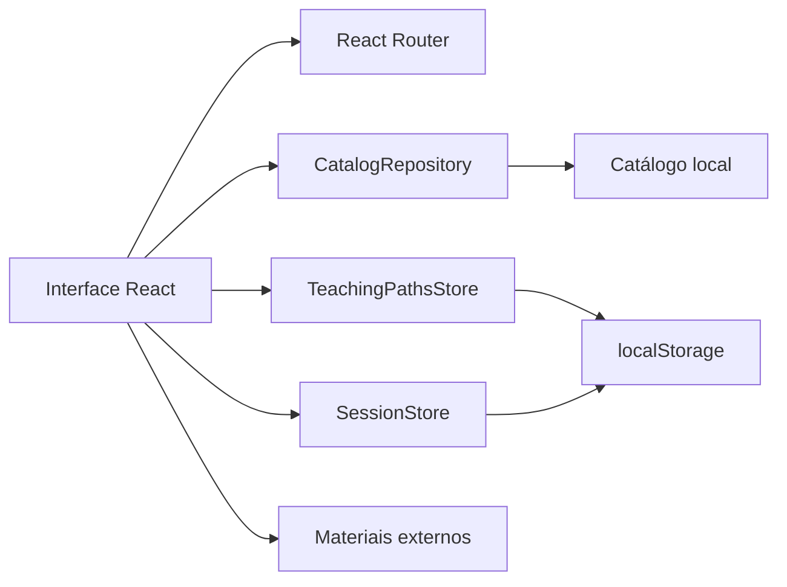
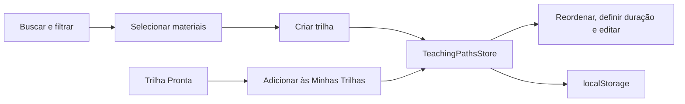

# Arquitetura do frontend

## Visão geral

O Informática Explorer é uma SPA estática construída com React, TypeScript e
Vite. A versão atual não depende de servidor próprio: o catálogo é local e a
sessão demonstrativa e as trilhas ficam no navegador.



## Organização

```text
.
├── .github/workflows/       # validação e deploy automático
├── config/                  # Vite, Vitest, Playwright e ESLint
├── docs/                    # TCC, curadoria e documentação técnica
├── public/                  # imagens e identidade visual
├── src/
│   ├── app/                 # composição de rotas
│   ├── components/          # componentes compartilhados
│   ├── data/                # catálogo local curado
│   ├── domain/              # tipos e validações de domínio
│   ├── features/            # funcionalidades por contexto
│   ├── lib/                 # utilitários puros
│   ├── repositories/        # limite de acesso ao catálogo
│   ├── store/               # sessão e trilhas pessoais
│   ├── styles/              # tokens e estilos globais
│   └── test/                # configuração comum de testes
└── tests/e2e/               # fluxos reais no Playwright
```

Cada feature expõe sua API pública em `index.ts`. Componentes compartilhados do
catálogo — diálogo acessível, estados de carregamento e apresentação de
metadados — continuam disponíveis para Buscar Materiais, Trilhas Prontas e
Minhas Trilhas.

## Decisões principais

### Rotas por hash

O `HashRouter` mantém a rota depois de `#`. Como o fragmento não é enviado ao
servidor, atualizar uma tela interna não depende de regras de reescrita no
GitHub Pages.

As rotas atuais são Buscar Materiais, detalhe do material, Trilhas Prontas,
Minhas Trilhas, Perfil e Sobre. URLs antigas de acervo, pastas e planos apenas
redirecionam para um fluxo atual e não carregam módulos legados.

### Caminho-base configurável

O Vite lê `VITE_BASE_PATH`. Localmente o valor padrão é `/`; no workflow ele é
`/<nome-do-repositorio>/`. O helper `publicAsset` aplica `BASE_URL` aos ativos
da pasta `public`, evitando links quebrados no Pages.

### Repositório de catálogo

A interface consome `CatalogRepository`, atualmente implementado por
`LocalCatalogRepository`. Um backend futuro poderá substituir essa classe sem
acoplar os componentes ao transporte HTTP.

Os anos escolares aceitos são centralizados em `SUPPORTED_GRADES`. O currículo
de um recurso associa ano, eixo, objeto, habilidade e competências, além da
origem e do estado do mapeamento. Os filtros consultam esses alinhamentos sem
combinar indevidamente uma habilidade com um ano ao qual ela não foi associada.

O catálogo é composto em `src/data/resources.mock.ts`. Coleções ficam separadas
por origem em `src/data/resources/`, e os textos da BNCC e o helper de criação
dos alinhamentos ficam em `src/data/bnccComputing.ts`.

Imagens licenciadas ficam em `public/images/cards/`, com miniaturas reduzidas
para a interface. Materiais sem permissão verificada para reutilização de imagem
usam o placeholder do projeto.

### Trilhas de ensino



`useTeachingPathsStore` persiste somente os identificadores dos materiais, os
metadados visuais da trilha e a duração escolhida para cada etapa. Os dados dos
materiais continuam vindo do catálogo, evitando snapshots duplicados.

As Trilhas Prontas usam os mesmos recursos e, quando copiadas, produzem um
registro comum no store. Assim, Minhas Trilhas não precisa distinguir a origem
da sequência para permitir edição.

Favoritos, pastas e planos de aula não possuem store, domínio ou feature na
versão atual. Chaves antigas no `localStorage` são ignoradas.

## Qualidade

- TypeScript em modo estrito para contratos e dados;
- ESLint para consistência e regras de React;
- Vitest e Testing Library para domínio, estado e componentes;
- Playwright em perfis desktop e mobile para os fluxos completos;
- axe-core para detectar violações automáticas de acessibilidade;
- GitHub Actions bloqueia o deploy se alguma verificação falhar.

## Evolução prevista

Backend, identidade, autorização e persistência remota devem continuar fora dos
componentes de apresentação. Novas áreas precisam ser introduzidas como features
com rota, domínio e testes próprios, evitando reativar código histórico sem uma
decisão explícita de produto.
