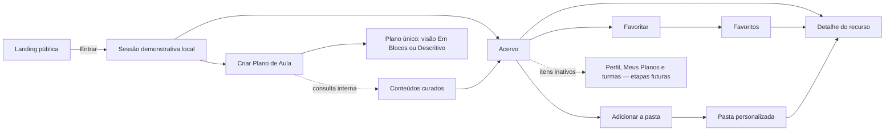

# Explora Computação — Especificação funcional e de interface

**Status:** documento histórico da versão anterior do protótipo
**Versão:** 0.7
**Data:** 30 de agosto de 2026
**Nome do produto:** Explora Computação
**Escopo registrado:** frontend com Acervo, organização pessoal e criador determinístico de planos

> **Atenção:** este documento preserva requisitos e decisões da versão anterior
> para fins acadêmicos. Favoritos, pastas e planos de aula foram removidos do
> produto em 14 de setembro de 2026. O escopo executável está descrito em
> [`estado-atual.md`](estado-atual.md).

## 1. Origem e precedência dos requisitos

Esta especificação consolida:

1. o arquivo [`registro-mestre-tcc.md`](registro-mestre-tcc.md), versão 1.0;
2. a descrição funcional fornecida em 9 de agosto de 2026;
3. as decisões sobre criação de planos fornecidas em 24 de agosto de 2026;
4. as decisões de recorte e curadoria fornecidas em 27 e 28 de agosto de 2026;
5. a revisão do fluxo, persistência, PDF e apresentação em blocos fornecida em 30 de agosto de 2026;
6. as referências visuais privadas fornecidas durante a concepção.

Quando o pedido atual acrescenta ou restringe algo que estava em aberto no registro mestre, esta especificação trata a informação mais recente como decisão de produto. Antes do início da implementação, essas novas decisões deverão ser registradas também no arquivo mestre.

As imagens de inspiração orientaram composição e ritmo visual, mas não são redistribuídas no repositório público. Textos, identidade, componentes, cores, conteúdo e comportamento respondem ao contexto do Explora Computação.

## 2. Visão do produto

O Explora Computação é uma plataforma web para apoiar docentes do 4º ao 9º ano do Ensino Fundamental a encontrar, compreender e organizar recursos voltados ao ensino de Computação e a criar planos de aula estruturados.

O produto responde a três problemas:

- recursos relevantes estão dispersos em diferentes sites e formatos;
- as descrições disponíveis nem sempre indicam o vínculo com a BNCC Computação ou as condições reais de uso;
- ferramentas generalistas de geração de planos de aula podem produzir propostas genéricas, com metodologia pouco executável, materiais desconectados das ações e tempo irreal.

O diferencial pretendido é preservar a relação:

**habilidade curricular → material curado compatível → metodologia executável → avaliação, quando aplicável**.

Acervo e criador de planos são fluxos de navegação independentes. No criador, o
docente escolhe um material depois do ano e da habilidade; a lista contém os
recursos alinhados com link seguro. A metodologia e a avaliação permanecem como
textos provisórios de lorem ipsum. A composição é determinística e não utiliza
IA. Planos podem ser salvos, pesquisados, editados e baixados como PDF.

### 2.1 Público principal

- Docentes que ensinam conteúdos de Computação.
- Atuação no Ensino Fundamental: 4º e 5º anos dos anos iniciais e 6º ao 9º ano dos anos finais.
- Não haverá contas de estudantes no protótipo.

### 2.2 Objetivos do produto

- Facilitar e agilizar a preparação de aulas.
- Dar visibilidade a recursos relevantes e curados.
- Organizar os recursos por metadados curriculares, pedagógicos e operacionais.
- Permitir busca e filtragem por recortes úteis ao docente.
- Ajudar o docente a criar coleções próprias com favoritos e pastas.
- Criar uma proposta estruturada de plano, fundamentada em material compatível do Acervo escolhido pelo docente.
- Oferecer visualizações **Em Blocos** e **Descritivo** do mesmo plano, sem trocar seu conteúdo.

### 2.3 Pilares do acervo

1. **Exposição:** tornar recursos relevantes visíveis e compreensíveis.
2. **Organização:** estruturar recursos com metadados consistentes.
3. **Filtragem:** permitir recortes por ano escolar e habilidade nesta primeira versão, com possibilidade de novas facetas depois.

## 3. Escopo implementado e limites

### 3.1 Base implementada

- Landing page pública narrativa.
- Cabeçalho público com ação **Entrar** no canto superior direito; nesta iteração, a ação cria a sessão local e abre diretamente o Acervo.
- Integração e modal de acesso por Google adiados para uma etapa futura.
- Área autenticada simulada iniciando na aba **Acervo**.
- Menu com **Meu perfil**, **Acervo**, **Meus Materiais**, **Minhas Turmas**, **Meus Planos de Aula**, **Criar Plano de Aula**, **Sobre** e **Sair**. Perfil e turmas permanecem inativos; criação e histórico local de planos estão ativos.
- Busca textual no acervo.
- Filtros de **Turma** e **Habilidade**.
- Cards de conteúdo com imagem ou imagem padrão.
- Página de detalhe de conteúdo.
- Favoritar e desfavoritar conteúdo.
- Pasta virtual **Favoritos**.
- Criação de pastas personalizadas.
- Inclusão e remoção de conteúdos nas pastas.
- Busca e filtros dentro de cada pasta.
- Persistência local da sessão demonstrativa, favoritos, pastas e planos.
- Itens inativos deixam visíveis as capacidades ainda não implementadas sem abrir telas ou simular resultados.
- Interface responsiva e acessível.

### 3.2 Criador de planos implementado

- **Criar Plano de Aula** ativo em rota própria.
- Acervo acessível de forma independente, sem exigir que o docente passe por um card, detalhe ou pasta antes de criar o plano.
- Seleção explícita de um material do Acervo alinhado ao ano e à habilidade.
- Inclusão dos recursos novos mesmo sem duração, função pedagógica ou proposta de aplicação, desde que possuam alinhamento e URL segura.
- Uma proposta única para uma, duas ou três aulas, sempre com 50 minutos por aula.
- Tipos de metodologia **expositiva dialogada**, **ativa/prática** e **combinada**.
- Materiais apresentados em lista própria, sem chips ou etiquetas flutuantes.
- Avaliação opcional com lorem ipsum provisório e integrada ao orçamento da última aula.
- Mesmo plano nos formatos **Em Blocos** e **Descritivo**.
- Salvamento, busca, edição e download em PDF.
- Função pedagógica no detalhe dos recursos; proposta de aplicação e sugestão de avaliação permanecem somente no modelo interno.
- Composição local por regras e conteúdo estruturado, sem IA.

### 3.3 Não incluído

- Backend, banco de dados ou API remota.
- Autenticação OAuth real ou coleta de credenciais Google.
- Chamadas a modelos de IA, prompts, streaming ou simulação de IA.
- Geração de propostas alternativas ou regeneração aleatória.
- Campo de turma, evidências de aprendizagem, anotações ou objeto de conhecimento no plano.
- Sincronização ou compartilhamento remoto de planos.
- Cadastro, upload, publicação ou edição de materiais por usuários.
- Área administrativa de curadoria.
- Contas ou dados pessoais de estudantes.
- Comentários, avaliações, compartilhamento social ou colaboração entre docentes.
- Métricas de visualização, download ou popularidade.
- Notificações.
- Hospedagem de arquivos externos.
- Plano de estudo para estudantes.

## 4. Terminologia da interface

| Termo | Uso definido |
|---|---|
| Ensino de Computação | Termo preferencial para o domínio do produto. |
| Acervo | Conjunto curado de recursos disponíveis na plataforma. |
| Recurso ou conteúdo | Site, jogo, texto, vídeo, simulador, atividade ou ferramenta catalogada. |
| Turma | Rótulo exclusivo dos filtros do Acervo; representa o **ano escolar recomendado**, e não uma classe específica como “7º A”. Não é campo do plano. |
| Habilidade | Unidade curricular filtrável, identificada por código e texto oficial da BNCC Computação. |
| Competência | Elemento mais amplo, relacionado à habilidade, mas não usado como sinônimo. |
| Pasta | Coleção pessoal de referências para um contexto de aula ou escola. |
| Favoritos | Pasta virtual fixa formada pelos recursos favoritados. |
| Aula | Unidade fixa de 50 minutos; um plano reúne uma, duas ou três aulas. |
| Tipo de metodologia | Opção controlada entre expositiva dialogada, ativa/prática e combinada. |
| Material | Item necessário a uma ação metodológica, incluindo conteúdo recuperado do Acervo, equipamento ou material de consumo. Não aparece como lista desvinculada da execução. |
| Proposta | Único plano composto para a solicitação; não é sinônimo de visualização. |

A estrutura curricular deverá preservar a hierarquia:

**etapa → ano → eixo → objeto de conhecimento → habilidade → competência relacionada**.

## 5. Arquitetura da informação

### 5.1 Rotas

| Rota | Tela ou comportamento |
|---|---|
| `/` | Landing page pública. |
| `/app` | Redireciona para `/app/acervo`. |
| `/app/acervo` | Acervo, busca e filtros. |
| `/app/acervo/:slug` | Detalhe de um recurso. |
| `/app/pastas` | Lista da pasta Favoritos e das pastas criadas. |
| `/app/pastas/:folderId` | Conteúdo de uma pasta com busca e filtros. |
| `/app/plano-de-aula` | Criador estruturado de uma proposta de plano. |
| qualquer outra | Página 404 com ação segura para voltar ao início ou ao Acervo. |

As rotas `/app/*` usam uma proteção de sessão local. Sem sessão, o usuário volta à página pública. Ao selecionar **Entrar**, a demonstração cria a sessão e abre diretamente `/app/acervo`; o fluxo Google e o redirecionamento pós-autenticação ficam adiados.

Em produção, o `HashRouter` serializa a rota lógica depois de `#`, por exemplo `/explora-computacao/#/app/acervo`. O fragmento preserva links diretos e recarregamento no GitHub Pages sem depender de rewrite no servidor.

### 5.2 Fluxo principal



## 6. Identidade visual e sistema de design

### 6.1 Marca

O símbolo principal está em [`public/branding/explora-computacao-symbol.svg`](../public/branding/explora-computacao-symbol.svg).

- Formato: SVG quadrado, escalável.
- Conceito: sinais de código em uma composição geométrica simples, com acento laranja.
- Uso no cabeçalho: símbolo à esquerda e o texto “Explora Computação” renderizado em HTML; o nome não deve ser incorporado como texto rasterizado.
- Área de proteção mínima: 20% da largura do símbolo.
- Tamanho mínimo recomendado do símbolo: 32 × 32 px.
- Não distorcer, girar, recolorir ou aplicar sombra adicional.

O símbolo é a identidade visual adotada neste protótipo acadêmico.

### 6.2 Paleta

A interface usa como referência as cores fornecidas para esta revisão de identidade. A fotografia do campus da UFSM permanece na página inicial, sem uso do brasão ou indicação de afiliação institucional.

| Token | Valor | Uso |
|---|---:|---|
| `brand.navy` | `#003F61` | Tom escuro derivado do azul para cabeçalho e rodapé. |
| `brand.blue` | `#005C8B` | Ações primárias e estados ativos. |
| `brand.orange` | `#F58634` | Destaques e pontos do símbolo. |
| `brand.gold` | `#D19C2C` | Acentos e destaques; usar texto escuro por cima. |
| `brand.bronze` | `#A06E38` | Apoio visual e variações das trilhas. |
| `surface.page` | `#F7F8F8` | Fundo geral derivado da prata. |
| `surface.soft` | `#F0F2F3` | Seções alternadas, filtros e estados suaves. |
| `surface.card` | `#FFFFFF` | Cards e diálogos. |
| `text.primary` | `#202427` | Texto principal. |
| `text.muted` | `#56616A` | Texto secundário com contraste validado. |
| `state.success` | `#287A4B` | Confirmações. |
| `state.warning` | `#9A6700` | Metadados em validação. |
| `state.error` | `#B42318` | Erros e ações destrutivas. |

Todos os pares de foreground/background devem ser validados para WCAG 2.2 AA. Cor nunca será o único meio de comunicar estado.

### 6.3 Tipografia

- Títulos editoriais da landing page: **Source Serif 4**, fallback `Georgia, serif`.
- Interface e texto corrido: **Inter**, fallback `system-ui, sans-serif`.
- Fontes deverão ser empacotadas com o projeto, evitando dependência de carregamento externo em tempo de execução.
- Escala fluida com `clamp()`; corpo mínimo de 16 px.

### 6.4 Forma, espaçamento e movimento

- Grid de espaçamento baseado em 4 px; intervalos mais usados: 8, 12, 16, 24, 32, 48, 64 e 96 px.
- Largura máxima editorial: 1200 px.
- Raio de cards: 16 px; botões e campos: 10 px; modal: 20 px.
- Sombras discretas, sem substituir bordas de contraste.
- Transições entre 120 e 220 ms.
- Respeitar `prefers-reduced-motion`; nenhum conteúdo depende de animação para ser entendido.

### 6.5 Imagem padrão de conteúdo

Recursos sem imagem autorizada usam [`public/branding/resource-placeholder-explora.svg`](../public/branding/resource-placeholder-explora.svg).

- Proporção: 16:9.
- Uso: decorativo, com `alt=""` quando o título do card já identifica o recurso.
- A imagem padrão nunca deve sugerir que é uma captura real do conteúdo.
- O arquivo pode receber variações futuras por tipo de recurso, mantendo o mesmo sistema visual.

## 7. Landing page pública

### 7.1 Cabeçalho

Inspirado na organização horizontal da primeira referência visual privada, adaptado à identidade do produto.

- Altura aproximada: 72 px em desktop e 64 px em mobile.
- Fundo `brand.navy`.
- Esquerda: símbolo e nome do produto, com link para o topo.
- Centro, em desktop: links âncora **O projeto**, **Acervo** e **Planos contextualizados**.
- Direita: botão **Entrar**.
- Em mobile: nome abreviado quando necessário, botão **Entrar** preservado e links em menu.
- O cabeçalho permanece visível durante a rolagem, com foco de teclado evidente.

### 7.2 Hero

- Altura: mínimo de 640 px em desktop e 560 px em mobile, sem altura fixa que corte o conteúdo.
- Imagem em largura total com `object-fit: cover`.
- Sobreposição em gradiente azul-marinho para garantir leitura.
- Conteúdo em largura controlada, preferencialmente alinhado à esquerda em desktop e centralizado em telas pequenas.

**Imagem selecionada:** fotografia do campus da Universidade Federal de Santa Maria, de Fillipe Richardt, 1920 × 1280 px, disponibilizada em CC0 no [Wikimedia Commons](https://commons.wikimedia.org/wiki/File:UFSM.2014.034.017.Campus-Santa-Maria-Filippe-Richardt.jpg). O arquivo distribuído está em [`public/images/hero-ufsm-campus-santa-maria.jpg`](../public/images/hero-ufsm-campus-santa-maria.jpg), com proveniência registrada em [`docs/creditos-e-licencas.md`](creditos-e-licencas.md). A escolha relaciona o projeto ao contexto educacional de Santa Maria e permite recorte responsivo.

**Texto principal, verbatim:**

> Explore. Planeje. Ensine.

**Texto breve sugerido:**

> O Explora Computação organiza recursos e facilita a criação de planos de aula contextualizados a partir da BNCC Computação e da realidade de cada turma.

**Ação:** botão **Conheça o projeto**, que rola para a próxima seção. Não haverá busca pública no hero nesta fase.

### 7.3 Seção “Por que o Explora Computação?”

Faixa clara, com texto central de leitura curta.

**Título sugerido:**

> Direcionamento e praticidade

**Texto-base editável:**

> Recursos para o ensino de Computação estão espalhados por diferentes sites e descritos de formas pouco consistentes. Existem plataformas que buscam agrupar esses conteúdos, contudo nem sempre é fácil saber para qual contexto um material é adequado e como utilizá-lo em sala de aula. O Explora Computação propõe uma forma de buscar recursos e criar planos de aula de forma contextualizada, apoiando a decisão do docente sem substituí-la.

### 7.4 Seção do Acervo

Inspirada no ritmo em duas colunas da segunda referência visual privada.

- Fundo azul.
- Imagem estática ou mockup do acervo à esquerda.
- Texto à direita.
- Em mobile, imagem antes do texto.

**Título sugerido:**

> Recursos em um só lugar, com contexto para usar

**Conteúdo mínimo:**

- referências externas e materiais autorizados centralizados;
- organização e filtragem por habilidade, competência, eixo e ano;
- direcionamento para abordagem de aula de forma contextualizada;
- pastas de organização para manutenção de materiais e planos para o futuro.

### 7.5 Seção “Planos contextualizados”

Bloco 50/50 com imagem e painel verde-azulado, retomando a alternância das referências visuais privadas.

- Apresentar a proposta de planos contextualizados sem sugerir que a geração já está ativa.
- Não usar campos, animações ou botões que aparentem geração ativa.

**Título sugerido:**

> Planos fundamentados nos conteúdos disponíveis

**Texto-base editável:**

> O criador relaciona ano escolar, habilidade e um material curado escolhido para montar uma, duas ou três aulas de 50 minutos. O plano organiza materiais, referência da BNCC, objetivo, metodologia e avaliação, e pode ser consultado nos formatos Em Blocos e Descritivo, sempre com revisão e decisão final do docente.

### 7.6 Rodapé

- Fundo `brand.navy` e texto branco.
- Nome do projeto e descrição curta.
- Links para **O projeto**, **Acervo** e **Entrar**.
- Indicação: “Protótipo desenvolvido como Trabalho de Conclusão de Curso”.
- Crédito da fotografia do hero e link para a licença CC0.
- Não exibir redes sociais ou contatos inexistentes.

## 8. Entrada e sessão demonstrativa

### 8.1 Comportamento nesta iteração

Ao selecionar **Entrar**:

1. criar uma sessão fictícia no navegador;
2. não solicitar nome, e-mail, senha ou token;
3. direcionar diretamente para `/app/acervo`;
4. transferir o foco para o conteúdo principal do Acervo e anunciar a mudança de contexto para tecnologia assistiva.

Não há diálogo intermediário nem botão **Continuar com Google** nesta iteração. O modal e a autenticação Google ficam adiados até que o fluxo real de identidade seja definido e implementado.

Ao selecionar **Sair**, remover apenas a sessão. Pastas e favoritos permanecem no navegador para simular dados vinculados à futura conta.

## 9. Estrutura da área autenticada

### 9.1 Navegação lateral

Inspirada na hierarquia da referência visual do painel, sem ações de publicação.

Ordem exata:

1. **Meu perfil**
2. **Acervo**
3. **Meus Materiais**
4. **Minhas Turmas**
5. **Meus Planos de Aula**
6. **Criar Plano de Aula**
7. **Sobre**
8. **Sair**

**Criar Plano de Aula** é um link operacional para `/app/plano-de-aula`.
**Meu perfil**, **Meus Planos de Aula** e **Minhas Turmas** continuam com
`aria-disabled="true"`. **Acervo**, **Meus Materiais**, **Criar Plano de Aula**,
**Sobre** e **Sair** são os cinco itens operacionais.

O item atual usa `aria-current="page"`, ícone, texto e contraste visual. Em desktop, a barra tem aproximadamente 240 px e pode permanecer fixa. Em mobile, vira um menu lateral acionado pela barra superior.

### 9.2 Barra superior

- Símbolo/nome em telas nas quais a barra lateral estiver recolhida.
- Campo de busca no contexto do Acervo ou da pasta atual.
- Avatar neutro de demonstração, sem foto ou dado pessoal real.
- Não incluir **Publicar recurso**, notificações ou ações administrativas.

### 9.3 Layout do conteúdo

- Fundo claro com textura muito discreta ou sem textura; legibilidade prevalece sobre decoração.
- Conteúdo com largura máxima de 1440 px.
- Grade responsiva de cards, em vez de carrossel horizontal.
- Cabeçalho de página com título, contagem de resultados e controles relacionados ao contexto.

## 10. Acervo

### 10.1 Estado inicial

- A primeira tela após entrar é **Acervo**.
- O corpus local contém **31 recursos**: **Cyberbullying — Jogo Educativo**, **Lightbot**, **Blockly Games**, **Interland**, quatro materiais didáticos de Rozelma França e as 23 atividades da coleção **Computação Desplugada — Unicamp**.
- Nenhum material de Educação Infantil ou do **Descobrindo o Computar** integra o recorte atual.
- A ordenação padrão é alfabética por título.
- Os controles permanecem visíveis mesmo quando uma busca ou combinação de filtros produz somente um resultado.

### 10.2 Busca

- Placeholder: **Buscar por título, tema ou habilidade**.
- Pesquisa em título, resumo, tipo, fornecedor, TAGs, eixo, objeto, código e texto da habilidade, número e texto da competência.
- Ignorar diferenças entre maiúsculas/minúsculas e entre caracteres com/sem acento.
- Aplicação após breve debounce ou ao enviar; ambas as interações devem ser acessíveis por teclado.
- O termo fica refletido na URL em `q`.

### 10.3 Filtros

Filtros iniciais:

- **Turma:** multisseleção com 4º, 5º, 6º, 7º, 8º e 9º ano, exibindo somente opções existentes no conjunto atual ou mantendo as indisponíveis desabilitadas.
- **Habilidade:** multisseleção com código e descrição curta.

Regras:

- seleções dentro do mesmo filtro usam união;
- o filtro isolado de Turma usa todos os anos de aplicação registrados para o recurso;
- ao combinar Turma e Habilidade, deve existir um alinhamento que associe exatamente esse ano ao código selecionado;
- o estado fica na URL, por exemplo `?q=cyber&turmas=7&habilidades=EF07CO09`;
- exibir chips dos filtros ativos, contagem de resultados e ação **Limpar filtros**;
- mudanças devem atualizar resultados e contagem sem recarregar a página;
- quando não houver resultado, explicar quais filtros estão ativos e oferecer a limpeza.

### 10.4 Card de recurso

Cada card apresenta:

- imagem 16:9 ou imagem padrão;
- título;
- turma/ano recomendado;
- eixo da BNCC Computação;
- botão de coração para favoritar, com `aria-pressed`, ícone preenchido e cor vermelha no estado ativo;
- menu de três pontos para adicionar o recurso a uma pasta.

Habilidade temática e códigos curriculares não aparecem no card. Eles ficam
reservados à página de detalhe, reduzindo a altura e mantendo os cartões
padronizados.

O clique na área principal do card abre o detalhe. As ações de favoritar e adicionar à pasta são botões independentes e não devem disparar a abertura do card.

## 11. Corpus inicial

### 11.1 Registro mínimo validado

| Campo | Valor inicial |
|---|---|
| ID | `altinovare-cyberbullying` |
| Título | Cyberbullying — Jogo Educativo |
| URL fornecida | `https://www.altinovare.com/pages/cyberbullying/index.php` |
| URL canônica observada | `https://www.altinovare.com.br/pages/cyberbullying/` |
| Fornecedor | ALT+INOVARE |
| Tipo | Jogo de simulação educativo |
| Idioma | Português do Brasil |
| Descrição | Uma simulação gamificada e interativa para apoiar as escolas no desenvolvimento da empatia, responsabilidade digital e no combate à violência virtual. O recurso apresenta dilemas cotidianos da vida digital aos alunos, promovendo a tomada de decisões éticas em conformidade com o ECA Digital e a BNCC de Computação. Esse jogo é apropriado após explicar e apresentar para os alunos o tema de cyberbullying. |
| Turma recomendada | 7º ano |
| Eixo | Cultura Digital |
| Objeto de conhecimento | Cyberbullying |
| Habilidade | **EF07CO09 — Reconhecer e debater sobre cyberbullying.** |
| Fonte curricular | [Computação na Educação Básica — Complemento à BNCC, p. 46 do documento](https://basenacionalcomum.mec.gov.br/images/historico/anexo_parecer_cneceb_n_2_2022_bncc_computacao.pdf) |
| Imagem | Captura fornecida pelo autor do TCC; crédito e situação autoral documentados no manifesto de ativos. |
| Objetivo de aprendizagem | Reconhecer situações de cyberbullying, analisar suas consequências e tomar decisões responsáveis para preveni-lo e combatê-lo. |
| Função pedagógica | Prática. |
| Proposta de aplicação | Reservar 5 minutos para retomar o tema e explicar a dinâmica; usar o jogo por 20 minutos quando houver avaliação ou até 30 sem avaliação; conduzir 10 minutos de conversa final; preservar 5 minutos para acesso, organização e transições. |
| Sugestão de avaliação | Solicitar um breve registro escrito sobre um dos dilemas trabalhados, no qual o estudante identifique a situação de cyberbullying e proponha uma atitude responsável para preveni-la ou enfrentá-la. |
| Duração | 50 min |
| Participação | Individual ou em grupos |
| Internet | Sim |
| Dispositivos | Computador ou notebook |
| Cadastro | Não |
| Fonte e licença informada | ALT+INOVARE — CC BY-NC-ND 3.0 BR |
| Última verificação | 12 de agosto de 2026 |

### 11.2 Dados não definidos

Função pedagógica, proposta de aplicação e sugestão de avaliação são orientações
produzidas pela curadoria, e não características declaradas pelo fornecedor.
Campos factuais não validados não são inventados nem apresentados como fatos. A
revisão periódica do recurso deve confirmar acessibilidade, compatibilidade de
navegadores, tratamento de dados pelo site externo e permanência da licença
informada.

### 11.3 Coleção Computação Desplugada — Unicamp

As 23 atividades estão cadastradas com título, turmas específicas, eixo,
habilidade, competências relacionadas, descrição, informações adicionais,
fonte, materiais conhecidos, links complementares e imagem associada. A fonte
informa licença **CC BY-NC-SA 4.0**.

Ano, habilidade e competências são correspondências curatoriais, porque a
coleção não publica esse alinhamento com a BNCC Computação. Cada correspondência
tem justificativa, força `forte` ou `parcial` e estado `pending`. Duração,
função pedagógica, proposta de aplicação, avaliação e dados de acessibilidade
não foram inventados; sua ausência mantém as atividades fora do criador de
planos. O processo completo está em
[`processo-curadoria-unicamp.md`](processo-curadoria-unicamp.md).

## 12. Detalhe do recurso

O conteúdo é aberto em rota própria com aparência de painel expandido, inspirada na referência visual privada de detalhe. Essa decisão oferece URL compartilhável, histórico do navegador, melhor operação em mobile e melhor acessibilidade do que um modal grande.

### 12.1 Cabeçalho do detalhe

- Breadcrumb: **Acervo / Cyberbullying — Jogo Educativo**.
- Imagem ou fallback 16:9 à esquerda em desktop.
- À direita: título, tipo, fornecedor, turma, eixo, uma **Habilidade** temática sem código e **Competências** contendo somente os códigos `EF...` relacionados.
- Ações:
  - **Acessar recurso**;
  - botão de coração para favoritar/desfavoritar;
  - **Adicionar à pasta**.

O acesso externo abre em nova guia com `rel="noopener noreferrer"` e um aviso textual de que o usuário sairá do Explora Computação.

### 12.2 Abas do detalhe

O detalhe usa um `tablist` acessível. Somente o painel selecionado permanece visível:

1. **Descrição** — abre por padrão e apresenta a descrição integral do recurso.
2. **Informações adicionais** — texto adicional, objetivo de aprendizagem, materiais, função pedagógica, duração, participação, necessidade de internet, dispositivos e cadastro. Proposta de aplicação e sugestão de avaliação não são exibidas.
3. **Fonte** — link da fonte original, licença e links de materiais complementares específicos. Estado, força e justificativa do alinhamento curricular permanecem internos e não são exibidos.

As abas respondem a clique e teclado. Não há nota numérica nem selo promocional de curadoria; a procedência e as limitações do alinhamento são apresentadas como informação auditável.

## 13. Favoritos e pastas

### 13.1 Favoritos

- **Favoritos** é uma pasta virtual fixa.
- Favoritar adiciona o recurso imediatamente a essa pasta.
- Desfavoritar remove o recurso dela.
- A pasta não pode ser renomeada nem excluída.
- Adicionar um recurso a uma pasta comum não o favorita automaticamente.

### 13.2 Meus Materiais

A página exibe:

- card da pasta **Favoritos** no início;
- pastas criadas pelo usuário;
- quantidade de recursos em cada pasta;
- botão **Criar pasta**;
- estado vazio com exemplo de uso.

### 13.3 Criação de pasta

- Abrir diálogo com campo **Nome da pasta**.
- Exemplo de apoio: “Turma sétimo ano — Escola Lívia Menna Barreto”.
- Nome obrigatório entre 1 e 80 caracteres depois de remover espaços laterais.
- Impedir duplicatas ignorando maiúsculas, minúsculas e espaços repetidos.
- Após criar, permitir incluir o recurso que iniciou o fluxo sem fechar e reabrir controles.

### 13.4 Inclusão e remoção

- O diálogo **Adicionar à pasta** lista as pastas existentes com caixas de seleção.
- O mesmo recurso pode pertencer a várias pastas.
- É possível criar uma pasta dentro desse diálogo.
- Remover de uma pasta não remove do Acervo nem de outras pastas.
- Toda ação produz confirmação visual e anúncio em região `aria-live`.

### 13.5 Conteúdo de uma pasta

- Reutiliza exatamente os componentes de busca, filtro, contagem e card do Acervo.
- Busca e filtros ficam recolhidos por padrão, podem ser exibidos por um toggle e são aplicados somente aos recursos contidos na pasta.
- Estado fica na URL da pasta.
- Pasta vazia orienta o usuário a voltar ao Acervo.

## 14. Meu perfil

O item permanece visível, porém inativo. Selecioná-lo não altera a URL nem abre uma tela. A definição de dados de perfil será retomada junto à autenticação real; não exibir e-mail, escola ou fotografia fictícios como se fossem dados reais.

## 15. Criar Plano de Aula

### 15.1 Navegação e independência do fluxo

**Criar Plano de Aula** é um item operacional e abre
`/app/plano-de-aula`. O docente pode iniciar a criação diretamente pelo menu,
sem navegar antes pelo Acervo, abrir um recurso ou organizar uma pasta.

Essa independência é de navegação, não de dados. O criador consulta o mesmo
catálogo e apresenta uma etapa explícita de escolha do material alinhado. Não
existe uma ação separada de “trocar proposta”: a escolha faz parte dos dados do
formulário e uma alteração exige recompor a mesma proposta.

### 15.2 Configuração

O formulário apresenta somente:

- **Tema:** texto obrigatório informado pelo docente;
- **Ano escolar:** opção entre 4º, 5º, 6º, 7º, 8º e 9º ano, sem representar uma turma concreta;
- **Habilidade:** opção controlada da BNCC Computação;
- **Quantidade de aulas:** uma, duas ou três;
- **Material do Acervo:** recurso alinhado ao ano e à habilidade;
- **Objetivo de aprendizagem:** texto editável, sugerido apenas quando o material possui esse metadado;
- **Tipo de metodologia:** **expositiva dialogada**, **ativa/prática** ou **combinada**;
- **Incluir avaliação:** decisão opcional.

Cada aula tem duração fixa de 50 minutos. Eixo e competências relacionados à
habilidade são derivados da referência curricular, sem nova seleção. O objeto
de conhecimento não integra o plano. Não são campos desta fase: turma,
evidências de aprendizagem ou anotações.

### 15.3 Recuperação da base curada

Ano e habilidade filtram o Acervo. Um recurso participa quando possui
alinhamento exato para a combinação e URL HTTP(S) segura. Duração, função
pedagógica e proposta de aplicação deixaram de ser critérios de exclusão nesta
fase, pois metodologia e avaliação ainda são placeholders.

- a origem escolhida permanece no plano para rastreabilidade;
- `pedagogy.materials` é combinado com dispositivos, Internet e conta;
- recursos sem duração recebem 50 minutos como fallback técnico; valores como
  “3 aulas” são interpretados sem excluir o material;
- recursos sem função ou proposta continuam disponíveis;
- um único material pode sustentar uma, duas ou três aulas;
- não existe chamada a uma IA para preencher lacunas.

### 15.4 Composição do plano

Cada solicitação produz uma única proposta estruturada com:

- tema e alinhamento curricular;
- objetivo de aprendizagem;
- uma, duas ou três aulas numeradas, com 50 minutos cada;
- metodologia provisória preenchida com um texto único de lorem ipsum;
- materiais vinculados à aula e apresentados sem chips ou etiquetas;
- avaliação opcional preenchida com um segundo texto de lorem ipsum.

Cada aula contém uma atividade central e cinco minutos de margem operacional.
Sem avaliação, a atividade recebe 45 minutos. Quando a avaliação é solicitada,
a última aula reserva 35 minutos para a atividade, dez para a avaliação e cinco
para a margem. Assim, a avaliação não aumenta o total além de 50 minutos. A
metodologia não é fragmentada em uma quantidade irreal de momentos apenas para
preencher uma estrutura textual.

A proposta de aplicação e a sugestão de avaliação do recurso não alimentam o
texto visível nesta fase. Metodologia e avaliação usam placeholders até a
definição do modelo pedagógico com a orientadora.

### 15.5 Tipos de metodologia

- **Expositiva dialogada:** articula apresentação orientada e diálogo com os estudantes; não é uma exposição unilateral genérica.
- **Ativa/prática:** concentra o tempo na realização, investigação ou resolução de uma atividade pelos estudantes, com mediação docente explícita.
- **Combinada:** integra uma contextualização expositiva dialogada e uma ação ativa/prática no mesmo plano, sem duplicar etapas nem ultrapassar o tempo.

Os três tipos permanecem disponíveis para os materiais selecionáveis. A escolha
altera a função solicitada no registro da aula, mas não muda o lorem ipsum
provisório.

### 15.6 Visualizações

O plano possui um único conteúdo canônico e duas formas de apresentação:

- **Em Blocos:** documento de consulta rápida com faixa geométrica e composição
  assimétrica, separado nos blocos **Materiais**,
  **BNCC** — com habilidade, eixo e competência —, **Objetivo**,
  **Metodologia** e **Avaliação**;
- **Descritiva:** documento em leitura contínua, organizado cronologicamente por
  aula, com duração, metodologia, materiais e avaliação da sessão.

Alternar entre elas não regenera, substitui, reorganiza nem troca a proposta.
As duas devem preservar habilidade, objetivo, sequência, tempos, materiais e
avaliação.

### 15.7 Composição local e limites

Não há IA, prompt, streaming, escolha de modelo ou conteúdo livre gerado por
LLM neste recorte. O plano é composto localmente por regras determinísticas,
dados curriculares e conteúdo curado do Acervo. Uma investigação futura de IA
continua possível, desde que receba especificação própria.

Planos são salvos como snapshots versionados no `localStorage`. **Meus Planos
de Aula** permite pesquisar pelo tema, ignorando caixa e acentos, abrir a edição
e baixar PDF. A edição preserva ID e data de criação. O PDF A4 é gerado
localmente a partir do mesmo plano canônico; nenhum Blob é persistido.

### 15.8 Minhas Turmas

O item **Minhas Turmas** também permanece visível e inativo. Ele antecipa uma possível organização futura por contexto docente, mas não cria, exibe ou armazena turmas nesta etapa.

### 15.9 Sobre

A página **Sobre** apresenta o propósito do Explora Computação, explica o uso de Favoritos e Meus Materiais e termina com um FAQ conciso. Não contém uma seção separada de passo a passo ou “Como utilizar”. O FAQ desta iteração possui seis perguntas e não descreve persistência local, propriedade dos recursos nem um processo interno de curadoria.

## 16. Modelo de dados do frontend

### 16.1 Recurso

```ts
type Grade = 4 | 5 | 6 | 7 | 8 | 9;

type BnccAxis =
  | "Pensamento Computacional"
  | "Mundo Digital"
  | "Cultura Digital";

type ValidationStatus = "validated" | "pending";
type CurriculumMappingKind = "source-declared" | "curatorial";
type CurriculumMappingStrength = "strong" | "partial";

interface SkillReference {
  code: string;
  officialText: string;
  sourceEdition: string;
  sourceUrl: string;
  validationStatus: ValidationStatus;
}

interface CompetencyReference {
  number: 1 | 2 | 3 | 4 | 5 | 6 | 7;
  officialText: string;
  sourceEdition: string;
  sourceUrl: string;
  validationStatus: ValidationStatus;
}

interface CurriculumAlignment {
  grade: Grade;
  axis: BnccAxis;
  knowledgeObject?: string;
  skill: SkillReference;
  competencies: CompetencyReference[];
  mapping: {
    kind: CurriculumMappingKind;
    strength: CurriculumMappingStrength;
    rationale: string;
    validationStatus: ValidationStatus;
  };
}

interface Resource {
  id: string;
  slug: string;
  title: string;
  sourceUrl: string;
  canonicalUrl?: string;
  provider: string;
  type: "game" | "video" | "text" | "simulator" | "activity" | "tool";
  language: string;
  summary: string;
  additionalInformation: string;
  curatorNotes?: string;
  recommendedGrades: Grade[];
  curriculum: {
    alignments: CurriculumAlignment[];
  };
  pedagogy: {
    learningObjective?: string;
    pedagogicalFunction?:
      | "introduction"
      | "exposition"
      | "exploration"
      | "practice"
      | "consolidation"
      | "assessment";
    applicationProposal?: string;
    assessmentSuggestion?: string;
    estimatedDuration?: string;
    participation?: Array<"individual" | "pair" | "group" | "whole-class">;
    methodologies?: string[];
    prerequisites?: string[];
    materials?: string[];
  };
  requirements: {
    internet?: boolean;
    devices?: string[];
    accountRequired?: boolean;
    pricing?: "free" | "freemium" | "paid" | "unknown";
  };
  accessibility: {
    evaluationStatus: ValidationStatus;
    knownFeatures: string[];
    potentialBarriers: string[];
    alternatives: string[];
  };
  provenance: {
    source: string;
    license?: string;
    curator?: string;
    lastVerifiedAt: string;
    status: "draft" | "verified" | "unavailable";
  };
  image?: {
    src: string;
    thumbnailSrc?: string;
    alt: string;
    focalPoint?: string;
    license?: string;
  };
  supplementaryLinks?: Array<{
    label: string;
    url: string;
  }>;
  tags: string[];
}
```

`recommendedGrades` contém todas as turmas em que o recurso pode ser aplicado,
segundo o público informado pela fonte dentro do recorte do projeto ou uma
decisão curatorial explícita quando ela não declara anos, além de eventuais
extensões documentadas. `curriculum.alignments` continua contendo
somente os pares ano–habilidade efetivamente registrados; a combinação dos dois
filtros não produz um produto cartesiano entre eles.

Os campos pedagógicos permanecem opcionais no contrato técnico. Nesta fase, a
elegibilidade do criador depende do alinhamento ano–habilidade e de uma URL
HTTP(S) segura; duração, função, proposta e sugestão de avaliação ausentes não
ocultam o recurso. Os dois textos pedagógicos provisórios são constantes do
domínio e não são apresentados como dados curados do material.

### 16.2 Biblioteca pessoal

```ts
interface UserFolder {
  id: string;
  name: string;
  resourceIds: string[];
  createdAt: string;
  updatedAt: string;
}

interface LocalLibraryState {
  schemaVersion: 1;
  favoriteResourceIds: string[];
  folders: UserFolder[];
}
```

### 16.3 Plano de aula

O modelo abaixo resume o contrato implementado. Os tipos completos, inclusive
avisos e proveniência de cada uso, permanecem no domínio.

```ts
type LessonCount = 1 | 2 | 3;

type MethodologyProfile =
  | "expository"
  | "active"
  | "combined";

interface LessonPlanFormInput {
  theme: string;
  grade: Grade;
  skillCode: string;
  selectedResourceId: string;
  objective: string;
  lessonCount: LessonCount;
  methodologyProfile: MethodologyProfile;
  includeEvaluation: boolean;
}

interface SavedLessonPlan {
  id: string;
  plan: ComposedLessonPlan;
  createdAt: string;
  updatedAt: string;
}

interface LessonMaterial {
  label: string;
  kind: "catalog-resource" | "support";
  href?: string;
}

interface LessonCentralActivity {
  title: string;
  description: string;
  durationMinutes: 35 | 45;
  materials: LessonMaterial[];
  resourceUse: {
    resourceId: string;
    resourceTitle: string;
    requestedFunction: LessonActivityFunction;
  };
}

interface LessonSession {
  number: 1 | 2 | 3;
  durationMinutes: 50;
  marginMinutes: 5;
  centralActivity: LessonCentralActivity;
}

interface LessonPlanEvaluation {
  description: string;
  durationMinutes: 10;
  sessionNumber: 1 | 2 | 3;
}

interface ComposedLessonPlan {
  theme: string;
  grade: Grade;
  skill: LessonPlanSkill;
  objective: string;
  methodologyProfile: MethodologyProfile;
  sessions: LessonSession[];
  evaluation?: LessonPlanEvaluation;
}

type ComposeLessonPlanResult =
  | { ok: true; plan: ComposedLessonPlan; warnings: LessonPlanCompositionWarning[] }
  | { ok: false; error: LessonPlanCompositionError };
```

O adaptador transforma o material escolhido em candidato do compositor. Seu ID
permanece na atividade e na avaliação para rastreabilidade. O modo de
visualização não pertence ao plano: **Em Blocos** e **Descritivo** são projeções
do mesmo objeto. O store persiste somente snapshots e datas, não HTML nem PDF.

Os componentes nunca importam o arquivo mock diretamente. Eles consomem contratos de repositório para permitir substituição posterior por uma API sem reescrever as telas.

## 17. Estados da interface

Toda tela baseada em dados deve prever:

- **carregando:** skeleton sem movimento obrigatório;
- **sucesso:** dados disponíveis;
- **vazio:** nenhum item ainda, com próximo passo útil;
- **sem resultados:** filtros não encontraram correspondência;
- **erro local:** falha de leitura ou gravação no navegador;
- **conteúdo indisponível:** link marcado como fora do ar;
- **metadado pendente:** informação ainda não validada pela curadoria.
- **base insuficiente:** o Acervo não possui conteúdo curado compatível para compor o plano solicitado; explicar a limitação sem gerar preenchimento genérico.

No protótipo local, atrasos artificiais não serão adicionados apenas para imitar uma API.

## 18. Responsividade

| Faixa | Comportamento |
|---|---|
| até 767 px | Uma coluna; menu lateral em drawer; filtros em painel; cards em uma coluna; detalhe empilhado. |
| 768–1199 px | Sidebar recolhível; cards em duas colunas; filtros podem quebrar linha. |
| 1200 px ou mais | Sidebar fixa; cards em três ou quatro colunas conforme largura útil. |

Regras gerais:

- alvos interativos mínimos de 44 × 44 px;
- nenhuma ação depende apenas de hover;
- hero usa ponto focal configurável;
- imagens abaixo da primeira dobra usam carregamento tardio;
- logo e imagens declaram dimensões para evitar saltos de layout;
- não haverá rolagem horizontal da página em 320 px de largura.

## 19. Acessibilidade e privacidade

Meta: **WCAG 2.2 nível AA**.

- Link **Pular para o conteúdo**.
- Landmarks e títulos em hierarquia correta.
- Navegação completa por teclado.
- Foco sempre visível.
- Entrada direta com foco transferido ao conteúdo principal do Acervo.
- Botão Favoritar com estado programático.
- Rótulos reais em busca e filtros; placeholder não substitui label.
- Contagem de resultados e confirmações anunciadas de forma não intrusiva.
- Campos do criador com rótulos, instruções e erros associados programaticamente.
- Alternância entre visualizações com estado anunciado sem mover o foco inesperadamente.
- Estado de base insuficiente anunciado com explicação e próximo passo seguro.
- Texto alternativo em imagens informativas e `alt=""` em imagens decorativas.
- Contraste AA e informação não dependente de cor.
- Suporte a zoom de 200% e reflow.
- Respeito a redução de movimento.
- Nenhuma coleta de credenciais ou dado de estudante.
- `localStorage` guarda apenas estado fictício da sessão, IDs de recursos e nomes de pastas criados pelo usuário.

## 20. Critérios de aceite

### Landing e entrada

- **LAND-01:** a landing contém cabeçalho, hero, explicação do problema, seção do acervo, seção sobre planos contextualizados e rodapé.
- **LAND-02:** o hero exibe exatamente “Explore. Planeje. Ensine.” e uma descrição breve do produto.
- **LAND-03:** a seção sobre planos comunica a composição estruturada apoiada pelo Acervo sem sugerir uso de IA.
- **LAND-04:** a fotografia escolhida possui fonte, licença, crédito e recorte responsivo documentados.
- **AUTH-01:** **Entrar** cria a sessão local demonstrativa e abre diretamente o Acervo, sem diálogo intermediário.
- **AUTH-02:** nenhuma credencial é solicitada ou enviada.
- **AUTH-03:** a entrada demonstrativa inicia no Acervo.

### Navegação e acervo

- **NAV-01:** o menu contém os oito itens definidos; seis itens operacionais navegam corretamente e Perfil e Turmas permanecem inativos.
- **ABOUT-01:** a página Sobre apresenta propósito, organização por Favoritos e Meus Materiais e um FAQ com seis perguntas, sem seção “Como utilizar”.
- **CAT-01:** o Acervo exibe busca, filtros de Turma e Habilidade, contagem e limpeza de filtros.
- **CAT-02:** busca e filtros são combináveis, persistem na URL e funcionam por teclado.
- **CAT-03:** o Acervo contém Cyberbullying — Jogo Educativo, Lightbot, Blockly Games, Interland, quatro materiais didáticos de Rozelma França e as 23 atividades da coleção Computação Desplugada — Unicamp, sem materiais de Educação Infantil ou materiais destinados exclusivamente do 1º ao 3º ano.
- **CAT-04:** o card apresenta título, turma e eixo; habilidade e códigos curriculares aparecem somente no detalhe.
- **CAT-05:** conteúdos sem imagem usam a imagem padrão, sem sugerir uma captura real.
- **CAT-06:** não existe ação de publicar, cadastrar ou enviar material.
- **CAT-07:** cards usam miniaturas otimizadas, conteúdo fora da tela reduz trabalho de pintura e diálogos de organização só são montados quando abertos.
- **CAT-08:** os dropdowns permanecem acima do coração e do menu de três pontos quando suas áreas se cruzam.

### Detalhe, favoritos e pastas

- **DET-01:** o detalhe possui URL própria e preserva o retorno ao Acervo com filtros.
- **DET-02:** o detalhe organiza o conteúdo nas abas **Descrição**, **Informações adicionais** e **Fonte**, exibindo somente a opção selecionada.
- **DET-03:** links externos informam a saída da plataforma e abrem de forma segura.
- **DET-04:** cada recurso apresenta descrição, informações adicionais, fonte, todas as turmas aplicáveis, habilidade temática e códigos curriculares; metadados opcionais ausentes aparecem como não informados, sem preenchimento inventado. Proposta de aplicação e sugestão de avaliação permanecem internas.
- **DET-05:** estado, força e justificativa das correspondências curatoriais permanecem internos; materiais complementares específicos mantêm links seguros para a fonte, sem os pacotes ZIP genéricos da coleção.
- **FAV-01:** favoritar inclui o conteúdo em Favoritos; desfavoritar remove.
- **FAV-02:** Favoritos não pode ser renomeada ou excluída.
- **FOL-01:** é possível criar uma pasta, adicionar e remover conteúdos.
- **FOL-02:** o exemplo “Turma sétimo ano — Escola Lívia Menna Barreto” é aceito como nome.
- **FOL-03:** cada pasta reutiliza busca e filtros do Acervo, inicialmente recolhidos e aplicados somente aos itens da pasta.
- **FOL-04:** favoritos e pastas persistem depois de recarregar a página.

### Criar Plano de Aula

- **PLAN-01:** **Criar Plano de Aula** abre `/app/plano-de-aula` diretamente pelo menu, sem exigir navegação prévia no Acervo.
- **PLAN-02:** o formulário contém tema, ano escolar, habilidade, material do Acervo, objetivo, quantidade de aulas, tipo de metodologia e opção de avaliação; não contém turma concreta, evidências, anotações nem objeto de conhecimento.
- **PLAN-03:** é possível escolher uma, duas ou três aulas; cada aula resultante possui exatamente 50 minutos e cinco minutos de margem operacional.
- **PLAN-04:** o seletor aceita expositiva dialogada, ativa/prática ou combinada para qualquer material elegível nesta fase provisória.
- **PLAN-05:** ano e habilidade filtram os materiais do Acervo; o docente escolhe um deles antes de compor.
- **PLAN-06:** todo recurso com alinhamento exato e URL segura aparece mesmo sem duração, função ou proposta de aplicação.
- **PLAN-07:** materiais aparecem como listas comuns, agregados em bloco próprio na versão Em Blocos e por aula na descritiva; o conteúdo do Acervo mantém um link seguro de acesso.
- **PLAN-08:** quando solicitada, a avaliação usa somente o lorem ipsum canônico e ocupa dez minutos da última aula, cuja atividade central é reduzida de 45 para 35 minutos.
- **PLAN-09:** a visualização Em Blocos usa cinco blocos temáticos e a descritiva usa uma sequência cronológica por aula, preservando o mesmo plano canônico.
- **PLAN-10:** não existe regeneração aleatória nem troca por uma alternativa sob a mesma configuração; uma recomposição só ocorre após alteração explícita dos parâmetros pelo docente. Não há prompt, streaming ou chamada a modelo de IA.
- **PLAN-11:** enquanto o modelo pedagógico estiver em discussão, a metodologia visível contém somente o lorem ipsum canônico e o plano não exibe chips de habilidade, eixo, perfil, recurso, material ou tempo.
- **PLAN-12:** quando um material possui objetivo cadastrado, o campo recebe esse texto e identifica a origem; sem esse dado, começa vazio.
- **PLAN-13:** salvar cria um snapshot em Meus Planos de Aula; editar atualiza o mesmo ID e a busca encontra temas sem diferenciar acentos ou caixa.
- **PLAN-14:** criação e histórico permitem baixar um PDF A4 derivado do mesmo plano canônico.

### Escopo, qualidade e responsividade

- **SCOPE-01:** não há backend, OAuth real, IA, sincronização remota de planos ou conta estudantil.
- **A11Y-01:** os fluxos principais funcionam apenas por teclado.
- **A11Y-02:** testes automatizados não apresentam violações críticas ou sérias de acessibilidade nos fluxos principais.
- **RESP-01:** os fluxos funcionam em larguras de 375, 768 e 1440 px.
- **QUAL-01:** build, checagem de tipos e testes terminam sem erro.

## 21. Decisões pendentes

| ID | Decisão | Tratamento até a definição |
|---|---|---|
| P-01 | Paleta oficial citada no pedido, mas ausente do registro mestre. | Usar tokens provisórios desta especificação e não tratá-los como definitivos. |
| P-03 | Quem aprova definitivamente as correspondências curatoriais de habilidades e competências? | Manter todas as associações da coleção Unicamp como `pending`, com justificativa e força visíveis, até validação acadêmica. |
| P-04 | Rubrica e responsável pela curadoria. | Manter o dado opcional no domínio; não exibir nota ou selo de curadoria nesta versão. |
| P-05 | Modelo híbrido ou apenas referatório. | Nesta fase, os recursos e arquivos didáticos permanecem externos; somente imagens cuja licença permite incorporação são armazenadas localmente com atribuição. |
| P-06 | Backend e orçamento. | O frontend está hospedado no GitHub Pages; manter contratos de repositório e persistência local substituível para a futura camada de servidor. |
| P-08 | Autenticação Google. | Sessão local demonstrativa com entrada direta no Acervo; modal e integração Google adiados. |
| P-10 | Cobertura mínima do Acervo para demonstrar os três tipos de metodologia e as três quantidades de aulas. | Definir corpus pequeno, mas diverso, antes da avaliação do criador. |

## 22. Referências

- [Registro mestre da proposta](registro-mestre-tcc.md).
- [Computação na Educação Básica — Complemento à BNCC](https://basenacionalcomum.mec.gov.br/images/historico/anexo_parecer_cneceb_n_2_2022_bncc_computacao.pdf).
- [Jogo Cyberbullying — ALT+INOVARE](https://www.altinovare.com.br/pages/cyberbullying/).
- [Computação Desplugada — Unicamp](https://desplugada.ime.unicamp.br/atividades.html).
- [Processo de curadoria da coleção Unicamp](processo-curadoria-unicamp.md).
- [Fotografia do campus da UFSM — Wikimedia Commons, CC0](https://commons.wikimedia.org/wiki/File:UFSM.2014.034.017.Campus-Santa-Maria-Filippe-Richardt.jpg).
- Referências visuais privadas fornecidas pelo autor do projeto, preservadas apenas no ambiente local e não redistribuídas.
