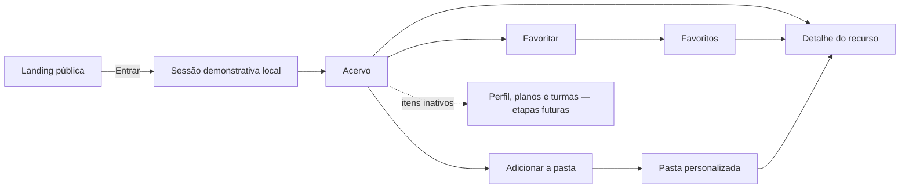

# Informática Explorer — Especificação funcional e de interface

**Status:** protótipo frontend implementado e publicado
**Versão:** 0.3
**Data:** 12 de agosto de 2026
**Nome do produto:** Informática Explorer — provisório
**Escopo desta versão:** frontend navegável com dados locais; sem backend, autenticação real ou geração por IA

## 1. Origem e precedência dos requisitos

Esta especificação consolida:

1. o arquivo [`registro-mestre-tcc.md`](registro-mestre-tcc.md), versão 0.7;
2. a descrição funcional fornecida em 9 de agosto de 2026;
3. as referências visuais privadas fornecidas durante a concepção.

Quando o pedido atual acrescenta ou restringe algo que estava em aberto no registro mestre, esta especificação trata a informação mais recente como decisão de produto. Antes do início da implementação, essas novas decisões deverão ser registradas também no arquivo mestre.

As imagens de inspiração orientaram composição e ritmo visual, mas não são redistribuídas no repositório público. Textos, identidade, componentes, cores, conteúdo e comportamento respondem ao contexto do Informática Explorer.

## 2. Visão do produto

O Informática Explorer é uma plataforma web para apoiar docentes dos anos finais do Ensino Fundamental a encontrar, compreender e organizar recursos voltados ao ensino de Computação.

O produto responde a três problemas:

- recursos relevantes estão dispersos em diferentes sites e formatos;
- as descrições disponíveis nem sempre indicam o vínculo com a BNCC Computação ou as condições reais de uso;
- ferramentas generalistas de geração de planos de aula podem produzir propostas genéricas quando não recebem fontes pedagógicas, infraestrutura disponível e contexto da turma.

O diferencial pretendido é preservar a relação:

**habilidade curricular → recurso curado → condições de uso → metodologia → evidências de aprendizagem**.

Nesta etapa, a plataforma demonstrará o acervo, a organização pessoal e a intenção futura de geração contextualizada. A geração de planos de aula não será simulada nem implementada.

### 2.1 Público principal

- Docentes que ensinam conteúdos de Computação.
- Atuação prioritária nos anos finais do Ensino Fundamental: 6º ao 9º ano.
- Não haverá contas de estudantes no protótipo.

### 2.2 Objetivos do produto

- Facilitar e agilizar a preparação de aulas.
- Dar visibilidade a recursos relevantes e curados.
- Organizar os recursos por metadados curriculares, pedagógicos e operacionais.
- Permitir busca e filtragem por recortes úteis ao docente.
- Ajudar o docente a criar coleções próprias com favoritos e pastas.
- Apresentar, sem ativá-la, a proposta futura de planos de aula contextualizados pelos recursos do acervo.

### 2.3 Pilares do acervo

1. **Exposição:** tornar recursos relevantes visíveis e compreensíveis.
2. **Organização:** estruturar recursos com metadados consistentes.
3. **Filtragem:** permitir recortes por ano escolar e habilidade nesta primeira versão, com possibilidade de novas facetas depois.

## 3. Escopo da primeira versão

### 3.1 Incluído

- Landing page pública narrativa.
- Cabeçalho público com ação **Entrar** no canto superior direito; nesta iteração, a ação cria a sessão local e abre diretamente o Acervo.
- Integração e modal de acesso por Google adiados para uma etapa futura.
- Área autenticada simulada iniciando na aba **Acervo**.
- Menu com **Meu perfil**, **Acervo**, **Meus Materiais**, **Minhas Turmas**, **Meus Planos de Aula**, **Criar Plano de Aula**, **Sobre** e **Sair**. **Meu perfil**, **Minhas Turmas**, **Meus Planos de Aula** e **Criar Plano de Aula** permanecem inativos nesta iteração.
- Busca textual no acervo.
- Filtros de **Turma** e **Habilidade**.
- Cards de conteúdo com imagem ou imagem padrão.
- Página de detalhe de conteúdo.
- Favoritar e desfavoritar conteúdo.
- Pasta virtual **Favoritos**.
- Criação de pastas personalizadas.
- Inclusão e remoção de conteúdos nas pastas.
- Busca e filtros dentro de cada pasta.
- Persistência local da sessão demonstrativa, favoritos e pastas.
- Itens inativos deixam visíveis as capacidades planejadas sem abrir telas ou simular resultados ainda não implementados.
- Interface responsiva e acessível.

### 3.2 Não incluído

- Backend, banco de dados ou API remota.
- Autenticação OAuth real ou coleta de credenciais Google.
- Geração, edição ou exportação de planos de aula.
- Chamadas a modelos de IA ou simulação de resultados de IA.
- Cadastro, upload, publicação ou edição de materiais por usuários.
- Área administrativa de curadoria.
- Contas ou dados pessoais de estudantes.
- Comentários, avaliações, compartilhamento social ou colaboração entre docentes.
- Métricas de visualização, download ou popularidade.
- Notificações.
- Hospedagem de arquivos externos.
- Plano de estudo para estudantes.

## 4. Terminologia da interface

| Termo | Uso definido |
|---|---|
| Ensino de Computação | Termo preferencial para o domínio do produto. |
| Acervo | Conjunto curado de recursos disponíveis na plataforma. |
| Recurso ou conteúdo | Site, jogo, texto, vídeo, simulador, atividade ou ferramenta catalogada. |
| Turma | Rótulo de interface solicitado para o filtro; nesta versão representa o **ano escolar recomendado**, e não uma classe específica como “7º A”. |
| Habilidade | Unidade curricular filtrável, identificada por código e texto oficial da BNCC Computação. |
| Competência | Elemento mais amplo, relacionado à habilidade, mas não usado como sinônimo. |
| Pasta | Coleção pessoal de referências para um contexto de aula ou escola. |
| Favoritos | Pasta virtual fixa formada pelos recursos favoritados. |

A estrutura curricular deverá preservar a hierarquia:

**etapa → ano → eixo → objeto de conhecimento → habilidade → competência relacionada**.

## 5. Arquitetura da informação

### 5.1 Rotas

| Rota | Tela ou comportamento |
|---|---|
| `/` | Landing page pública. |
| `/app` | Redireciona para `/app/acervo`. |
| `/app/acervo` | Acervo, busca e filtros. |
| `/app/acervo/:slug` | Detalhe de um recurso. |
| `/app/pastas` | Lista da pasta Favoritos e das pastas criadas. |
| `/app/pastas/:folderId` | Conteúdo de uma pasta com busca e filtros. |
| qualquer outra | Página 404 com ação segura para voltar ao início ou ao Acervo. |

As rotas `/app/*` usam uma proteção de sessão local. Sem sessão, o usuário volta à página pública. Ao selecionar **Entrar**, a demonstração cria a sessão e abre diretamente `/app/acervo`; o fluxo Google e o redirecionamento pós-autenticação ficam adiados.

Em produção, o `HashRouter` serializa a rota lógica depois de `#`, por exemplo `/informatica-explorer/#/app/acervo`. O fragmento preserva links diretos e recarregamento no GitHub Pages sem depender de rewrite no servidor.

### 5.2 Fluxo principal



## 6. Identidade visual e sistema de design

### 6.1 Marca

O símbolo principal está em [`public/branding/informatica-explorer-logo.png`](../public/branding/informatica-explorer-logo.png).

- Formato: PNG quadrado, 1254 × 1254 px, fundo transparente.
- Conceito: um “i” minúsculo azul/ciano atravessado por uma órbita amarela, associado a descoberta, navegação e conexão.
- Uso no cabeçalho: símbolo à esquerda e o texto “Informática Explorer” renderizado em HTML; o nome não deve ser incorporado como texto rasterizado.
- Área de proteção mínima: 20% da largura do ponto do “i”.
- Tamanho mínimo recomendado do símbolo: 32 × 32 px.
- Não distorcer, girar, recolorir ou aplicar sombra adicional.

O símbolo é uma exploração provisória de marca para o TCC, não uma identidade final registrada. Antes de divulgação pública, deverá passar por revisão de legibilidade, originalidade e aplicação em tamanhos pequenos.

### 6.2 Paleta provisória

> Nota de consistência: a versão 0.4 do registro mestre menciona uma paleta no pedido, mas não contém nomes nem valores de cores. Por isso, os tokens abaixo são **provisórios**, derivados da marca criada e do caráter educacional do produto. Eles não devem ser apresentados como cores extraídas do registro mestre.

| Token | Valor | Uso |
|---|---:|---|
| `brand.navy` | `#082F49` | Cabeçalho, rodapé, texto sobre fundos claros. |
| `brand.blue` | `#075985` | Ações primárias e estados ativos. |
| `brand.cyan` | `#0891B2` | Destaques, ícones e apoio visual; não usar como texto pequeno sobre branco. |
| `brand.yellow` | `#FACC15` | Acentos, órbitas e destaques; usar texto escuro por cima. |
| `surface.page` | `#F8FAFC` | Fundo geral. |
| `surface.soft` | `#EAF4F7` | Seções alternadas, filtros e estados suaves. |
| `surface.card` | `#FFFFFF` | Cards e diálogos. |
| `text.primary` | `#14212B` | Texto principal. |
| `text.muted` | `#52616B` | Texto secundário com contraste validado. |
| `state.success` | `#287A4B` | Confirmações. |
| `state.warning` | `#9A6700` | Metadados em validação. |
| `state.error` | `#B42318` | Erros e ações destrutivas. |

Todos os pares de foreground/background devem ser validados para WCAG 2.2 AA. Cor nunca será o único meio de comunicar estado.

### 6.3 Tipografia

- Títulos editoriais da landing page: **Source Serif 4**, fallback `Georgia, serif`.
- Interface e texto corrido: **Inter**, fallback `system-ui, sans-serif`.
- Fontes deverão ser empacotadas com o projeto, evitando dependência de carregamento externo em tempo de execução.
- Escala fluida com `clamp()`; corpo mínimo de 16 px.

### 6.4 Forma, espaçamento e movimento

- Grid de espaçamento baseado em 4 px; intervalos mais usados: 8, 12, 16, 24, 32, 48, 64 e 96 px.
- Largura máxima editorial: 1200 px.
- Raio de cards: 16 px; botões e campos: 10 px; modal: 20 px.
- Sombras discretas, sem substituir bordas de contraste.
- Transições entre 120 e 220 ms.
- Respeitar `prefers-reduced-motion`; nenhum conteúdo depende de animação para ser entendido.

### 6.5 Imagem padrão de conteúdo

Recursos sem imagem autorizada usam [`public/branding/resource-placeholder.svg`](../public/branding/resource-placeholder.svg).

- Proporção: 16:9.
- Uso: decorativo, com `alt=""` quando o título do card já identifica o recurso.
- A imagem padrão nunca deve sugerir que é uma captura real do conteúdo.
- O arquivo pode receber variações futuras por tipo de recurso, mantendo o mesmo sistema visual.

## 7. Landing page pública

### 7.1 Cabeçalho

Inspirado na organização horizontal da primeira referência visual privada, adaptado à identidade do produto.

- Altura aproximada: 72 px em desktop e 64 px em mobile.
- Fundo `brand.navy`.
- Esquerda: símbolo e nome do produto, com link para o topo.
- Centro, em desktop: links âncora **O projeto**, **Acervo** e **Planos contextualizados**.
- Direita: botão **Entrar**.
- Em mobile: nome abreviado quando necessário, botão **Entrar** preservado e links em menu.
- O cabeçalho permanece visível durante a rolagem, com foco de teclado evidente.

### 7.2 Hero

- Altura: mínimo de 640 px em desktop e 560 px em mobile, sem altura fixa que corte o conteúdo.
- Imagem em largura total com `object-fit: cover`.
- Sobreposição em gradiente azul-marinho para garantir leitura.
- Conteúdo em largura controlada, preferencialmente alinhado à esquerda em desktop e centralizado em telas pequenas.

**Imagem selecionada:** fotografia do campus da Universidade Federal de Santa Maria, de Fillipe Richardt, 1920 × 1280 px, disponibilizada em CC0 no [Wikimedia Commons](https://commons.wikimedia.org/wiki/File:UFSM.2014.034.017.Campus-Santa-Maria-Filippe-Richardt.jpg). O arquivo distribuído está em [`public/images/hero-ufsm-campus-santa-maria.jpg`](../public/images/hero-ufsm-campus-santa-maria.jpg), com proveniência registrada em [`docs/creditos-e-licencas.md`](creditos-e-licencas.md). A escolha relaciona o projeto ao contexto educacional de Santa Maria e permite recorte responsivo.

**Texto principal, verbatim:**

> Explore. Planeje. Ensine.

**Texto breve sugerido:**

> O Informática Explorer organiza recursos e facilita a criação de planos de aula contextualizados a partir da BNCC Computação e da realidade de cada turma.

**Ação:** botão **Conheça o projeto**, que rola para a próxima seção. Não haverá busca pública no hero nesta fase.

### 7.3 Seção “Por que o Informática Explorer?”

Faixa clara, com texto central de leitura curta.

**Título sugerido:**

> Direcionamento e praticidade

**Texto-base editável:**

> Recursos para o ensino de Computação estão espalhados por diferentes sites e descritos de formas pouco consistentes. Existem plataformas que buscam agrupar esses conteúdos, contudo nem sempre é fácil saber para qual contexto um material é adequado e como utilizá-lo em sala de aula. O Informática Explorer propõe uma forma de buscar recursos e criar planos de aula de forma contextualizada, apoiando a decisão do docente sem substituí-la.

### 7.4 Seção do Acervo

Inspirada no ritmo em duas colunas da segunda referência visual privada.

- Fundo azul.
- Imagem estática ou mockup do acervo à esquerda.
- Texto à direita.
- Em mobile, imagem antes do texto.

**Título sugerido:**

> Recursos em um só lugar, com contexto para usar

**Conteúdo mínimo:**

- referências externas e materiais autorizados centralizados;
- organização e filtragem por habilidade, competência, eixo e ano;
- direcionamento para abordagem de aula de forma contextualizada;
- pastas de organização para manutenção de materiais e planos para o futuro.

### 7.5 Seção “Planos contextualizados”

Bloco 50/50 com imagem e painel verde-azulado, retomando a alternância das referências visuais privadas.

- Apresentar a proposta de planos contextualizados sem sugerir que a geração já está ativa.
- Não usar campos, animações ou botões que aparentem geração ativa.

**Título sugerido:**

> Planos ancorados nos recursos disponíveis

**Texto-base editável:**

> A proposta é usar os recursos curados e seus metadados como contexto para apoiar a criação de planos de aula mais rastreáveis e aplicáveis. Habilidade, metodologia, tempo, materiais e infraestrutura deverão permanecer conectados às fontes do acervo, sempre com revisão e decisão final do docente.

### 7.6 Rodapé

- Fundo `brand.navy` e texto branco.
- Nome do projeto e descrição curta.
- Links para **O projeto**, **Acervo** e **Entrar**.
- Indicação: “Protótipo desenvolvido como Trabalho de Conclusão de Curso”.
- Crédito da fotografia do hero e link para a licença CC0.
- Não exibir redes sociais ou contatos inexistentes.

## 8. Entrada e sessão demonstrativa

### 8.1 Comportamento nesta iteração

Ao selecionar **Entrar**:

1. criar uma sessão fictícia no navegador;
2. não solicitar nome, e-mail, senha ou token;
3. direcionar diretamente para `/app/acervo`;
4. transferir o foco para o conteúdo principal do Acervo e anunciar a mudança de contexto para tecnologia assistiva.

Não há diálogo intermediário nem botão **Continuar com Google** nesta iteração. O modal e a autenticação Google ficam adiados até que o fluxo real de identidade seja definido e implementado.

Ao selecionar **Sair**, remover apenas a sessão. Pastas e favoritos permanecem no navegador para simular dados vinculados à futura conta.

## 9. Estrutura da área autenticada

### 9.1 Navegação lateral

Inspirada na hierarquia da referência visual do painel, sem ações de publicação.

Ordem exata:

1. **Meu perfil**
2. **Acervo**
3. **Meus Materiais**
4. **Minhas Turmas**
5. **Meus Planos de Aula**
6. **Criar Plano de Aula**
7. **Sobre**
8. **Sair**

**Meu perfil**, **Meus Planos de Aula**, **Criar Plano de Aula** e **Minhas Turmas** são controles inativos: apresentam `aria-disabled="true"`, não alteram a URL e não abrem conteúdo. **Acervo**, **Meus Materiais**, **Sobre** e **Sair** permanecem operacionais.

O item atual usa `aria-current="page"`, ícone, texto e contraste visual. Em desktop, a barra tem aproximadamente 240 px e pode permanecer fixa. Em mobile, vira um menu lateral acionado pela barra superior.

### 9.2 Barra superior

- Símbolo/nome em telas nas quais a barra lateral estiver recolhida.
- Campo de busca no contexto do Acervo ou da pasta atual.
- Avatar neutro de demonstração, sem foto ou dado pessoal real.
- Não incluir **Publicar recurso**, notificações ou ações administrativas.

### 9.3 Layout do conteúdo

- Fundo claro com textura muito discreta ou sem textura; legibilidade prevalece sobre decoração.
- Conteúdo com largura máxima de 1440 px.
- Grade responsiva de cards, em vez de carrossel horizontal.
- Cabeçalho de página com título, contagem de resultados e controles relacionados ao contexto.

## 10. Acervo

### 10.1 Estado inicial

- A primeira tela após entrar é **Acervo**.
- O único recurso inicial é o jogo **Cyberbullying — Jogo Educativo**.
- A ordenação padrão é alfabética por título.
- Com um único resultado, todos os controles continuam visíveis para demonstrar a arquitetura futura.

### 10.2 Busca

- Placeholder: **Buscar por título, tema ou habilidade**.
- Pesquisa em título, resumo, tipo, fornecedor, TAGs, código e texto da habilidade.
- Ignorar diferenças entre maiúsculas/minúsculas e entre caracteres com/sem acento.
- Aplicação após breve debounce ou ao enviar; ambas as interações devem ser acessíveis por teclado.
- O termo fica refletido na URL em `q`.

### 10.3 Filtros

Filtros iniciais:

- **Turma:** multisseleção com 6º, 7º, 8º e 9º ano, exibindo somente opções existentes no conjunto atual ou mantendo as indisponíveis desabilitadas.
- **Habilidade:** multisseleção com código e descrição curta.

Regras:

- seleções dentro do mesmo filtro usam união;
- filtros diferentes usam interseção;
- o estado fica na URL, por exemplo `?q=cyber&turmas=7&habilidades=EF07CO09`;
- exibir chips dos filtros ativos, contagem de resultados e ação **Limpar filtros**;
- mudanças devem atualizar resultados e contagem sem recarregar a página;
- quando não houver resultado, explicar quais filtros estão ativos e oferecer a limpeza.

### 10.4 Card de recurso

Cada card apresenta:

- imagem 16:9 ou imagem padrão;
- título;
- turma/ano recomendado;
- eixo da BNCC Computação;
- texto curto da habilidade, sem exibir o código no preview;
- botão de coração para favoritar, com `aria-pressed`, ícone preenchido e cor vermelha no estado ativo;
- menu de três pontos para adicionar o recurso a uma pasta.

O clique na área principal do card abre o detalhe. As ações de favoritar e adicionar à pasta são botões independentes e não devem disparar a abertura do card.

## 11. Recurso inicial

### 11.1 Registro mínimo validado

| Campo | Valor inicial |
|---|---|
| ID | `altinovare-cyberbullying` |
| Título | Cyberbullying — Jogo Educativo |
| URL fornecida | `https://www.altinovare.com/pages/cyberbullying/index.php` |
| URL canônica observada | `https://www.altinovare.com.br/pages/cyberbullying/` |
| Fornecedor | ALT+INOVARE |
| Tipo | Jogo de simulação educativo |
| Idioma | Português do Brasil |
| Descrição | Uma simulação gamificada e interativa para apoiar as escolas no desenvolvimento da empatia, responsabilidade digital e no combate à violência virtual. O recurso apresenta dilemas cotidianos da vida digital aos alunos, promovendo a tomada de decisões éticas em conformidade com o ECA Digital e a BNCC de Computação. Esse jogo é apropriado após explicar e apresentar para os alunos o tema de cyberbullying. |
| Turma recomendada | 7º ano |
| Eixo | Cultura Digital |
| Objeto de conhecimento | Cyberbullying |
| Habilidade | **EF07CO09 — Reconhecer e debater sobre cyberbullying.** |
| Fonte curricular | [Computação na Educação Básica — Complemento à BNCC, p. 46 do documento](https://basenacionalcomum.mec.gov.br/images/historico/anexo_parecer_cneceb_n_2_2022_bncc_computacao.pdf) |
| Imagem | Captura fornecida pelo autor do TCC; crédito e situação autoral documentados no manifesto de ativos. |
| Objetivo de aprendizagem | Reconhecer situações de cyberbullying, analisar suas consequências e tomar decisões responsáveis para preveni-lo e combatê-lo. |
| Duração | 50 min |
| Participação | Individual ou em grupos |
| Internet | Sim |
| Dispositivos | Computador ou notebook |
| Cadastro | Não |
| Fonte e licença informada | ALT+INOVARE — CC BY-NC-ND 3.0 BR |
| Última verificação | 12 de agosto de 2026 |

### 11.2 Dados não definidos

Campos não validados não são inventados nem apresentados como fatos. A revisão periódica do recurso deve confirmar acessibilidade, compatibilidade de navegadores, tratamento de dados pelo site externo e permanência da licença informada.

## 12. Detalhe do recurso

O conteúdo é aberto em rota própria com aparência de painel expandido, inspirada na referência visual privada de detalhe. Essa decisão oferece URL compartilhável, histórico do navegador, melhor operação em mobile e melhor acessibilidade do que um modal grande.

### 12.1 Cabeçalho do detalhe

- Breadcrumb: **Acervo / Cyberbullying — Jogo Educativo**.
- Imagem ou fallback 16:9 à esquerda em desktop.
- À direita: título, tipo, fornecedor, turma, eixo e **Habilidade e competência**.
- Ações:
  - **Acessar recurso**;
  - botão de coração para favoritar/desfavoritar;
  - **Adicionar à pasta**.

O acesso externo abre em nova guia com `rel="noopener noreferrer"` e um aviso textual de que o usuário sairá do Informática Explorer.

### 12.2 Abas do detalhe

O detalhe usa um `tablist` acessível. Somente o painel selecionado permanece visível:

1. **Descrição** — abre por padrão e apresenta a descrição integral do recurso.
2. **Informações adicionais** — objetivo de aprendizagem, duração, participação, necessidade de internet, dispositivos e cadastro.
3. **Fonte** — fornecedor e licença informada.

As abas respondem a clique e teclado. Não há selo de curadoria, nota da curadoria ou as antigas seções de alinhamento, uso e acessibilidade nesta versão.

## 13. Favoritos e pastas

### 13.1 Favoritos

- **Favoritos** é uma pasta virtual fixa.
- Favoritar adiciona o recurso imediatamente a essa pasta.
- Desfavoritar remove o recurso dela.
- A pasta não pode ser renomeada nem excluída.
- Adicionar um recurso a uma pasta comum não o favorita automaticamente.

### 13.2 Meus Materiais

A página exibe:

- card da pasta **Favoritos** no início;
- pastas criadas pelo usuário;
- quantidade de recursos em cada pasta;
- botão **Criar pasta**;
- estado vazio com exemplo de uso.

### 13.3 Criação de pasta

- Abrir diálogo com campo **Nome da pasta**.
- Exemplo de apoio: “Turma sétimo ano — Escola Lívia Menna Barreto”.
- Nome obrigatório entre 1 e 80 caracteres depois de remover espaços laterais.
- Impedir duplicatas ignorando maiúsculas, minúsculas e espaços repetidos.
- Após criar, permitir incluir o recurso que iniciou o fluxo sem fechar e reabrir controles.

### 13.4 Inclusão e remoção

- O diálogo **Adicionar à pasta** lista as pastas existentes com caixas de seleção.
- O mesmo recurso pode pertencer a várias pastas.
- É possível criar uma pasta dentro desse diálogo.
- Remover de uma pasta não remove do Acervo nem de outras pastas.
- Toda ação produz confirmação visual e anúncio em região `aria-live`.

### 13.5 Conteúdo de uma pasta

- Reutiliza exatamente os componentes de busca, filtro, contagem e card do Acervo.
- Busca e filtros ficam recolhidos por padrão, podem ser exibidos por um toggle e são aplicados somente aos recursos contidos na pasta.
- Estado fica na URL da pasta.
- Pasta vazia orienta o usuário a voltar ao Acervo.

## 14. Meu perfil

O item permanece visível, porém inativo. Selecioná-lo não altera a URL nem abre uma tela. A definição de dados de perfil será retomada junto à autenticação real; não exibir e-mail, escola ou fotografia fictícios como se fossem dados reais.

## 15. Criar Plano de Aula

Os itens **Meus Planos de Aula** e **Criar Plano de Aula** permanecem visíveis, porém inativos. Selecioná-los não altera a URL nem abre uma tela. Não haverá formulário, botão **Gerar**, streaming, texto gerado, mock de IA ou promessa de disponibilidade nesta iteração.

## 15.1 Minhas Turmas

O item **Minhas Turmas** também permanece visível e inativo. Ele antecipa uma possível organização futura por contexto docente, mas não cria, exibe ou armazena turmas nesta etapa.

## 15.2 Sobre

A página **Sobre** apresenta o propósito do Informática Explorer, explica o uso de Favoritos e Meus Materiais e termina com um FAQ conciso. Não contém uma seção separada de passo a passo ou “Como utilizar”. O FAQ desta iteração possui seis perguntas e não descreve persistência local, propriedade dos recursos nem um processo interno de curadoria.

## 16. Modelo de dados do frontend

### 16.1 Recurso

```ts
type Grade = 6 | 7 | 8 | 9;

type BnccAxis =
  | "Pensamento Computacional"
  | "Mundo Digital"
  | "Cultura Digital";

type ValidationStatus = "validated" | "pending";

interface SkillReference {
  code: string;
  officialText: string;
  sourceEdition: string;
  sourceUrl: string;
  validationStatus: ValidationStatus;
}

interface Resource {
  id: string;
  slug: string;
  title: string;
  sourceUrl: string;
  canonicalUrl?: string;
  provider: string;
  type: "game" | "video" | "text" | "simulator" | "activity" | "tool";
  language: string;
  summary: string;
  curatorNotes?: string;
  recommendedGrades: Grade[];
  curriculum: {
    axis: BnccAxis;
    knowledgeObject?: string;
    skills: SkillReference[];
    relatedCompetencies?: string[];
  };
  pedagogy: {
    learningObjective?: string;
    estimatedDuration?: string;
    participation?: Array<"individual" | "pair" | "group" | "whole-class">;
    methodologies?: string[];
    prerequisites?: string[];
  };
  requirements: {
    internet?: boolean;
    devices?: string[];
    accountRequired?: boolean;
    pricing?: "free" | "freemium" | "paid" | "unknown";
  };
  accessibility: {
    evaluationStatus: ValidationStatus;
    knownFeatures: string[];
    potentialBarriers: string[];
    alternatives: string[];
  };
  provenance: {
    source: string;
    license?: string;
    curator?: string;
    lastVerifiedAt: string;
    status: "draft" | "verified" | "unavailable";
  };
  image?: {
    src: string;
    alt: string;
    focalPoint?: string;
    license?: string;
  };
  tags: string[];
}
```

### 16.2 Biblioteca pessoal

```ts
interface UserFolder {
  id: string;
  name: string;
  resourceIds: string[];
  createdAt: string;
  updatedAt: string;
}

interface LocalLibraryState {
  schemaVersion: 1;
  favoriteResourceIds: string[];
  folders: UserFolder[];
}
```

Os componentes nunca importam o arquivo mock diretamente. Eles consomem contratos de repositório para permitir substituição posterior por uma API sem reescrever as telas.

## 17. Estados da interface

Toda tela baseada em dados deve prever:

- **carregando:** skeleton sem movimento obrigatório;
- **sucesso:** dados disponíveis;
- **vazio:** nenhum item ainda, com próximo passo útil;
- **sem resultados:** filtros não encontraram correspondência;
- **erro local:** falha de leitura ou gravação no navegador;
- **conteúdo indisponível:** link marcado como fora do ar;
- **metadado pendente:** informação ainda não validada pela curadoria.

No protótipo local, atrasos artificiais não serão adicionados apenas para imitar uma API.

## 18. Responsividade

| Faixa | Comportamento |
|---|---|
| até 767 px | Uma coluna; menu lateral em drawer; filtros em painel; cards em uma coluna; detalhe empilhado. |
| 768–1199 px | Sidebar recolhível; cards em duas colunas; filtros podem quebrar linha. |
| 1200 px ou mais | Sidebar fixa; cards em três ou quatro colunas conforme largura útil. |

Regras gerais:

- alvos interativos mínimos de 44 × 44 px;
- nenhuma ação depende apenas de hover;
- hero usa ponto focal configurável;
- imagens abaixo da primeira dobra usam carregamento tardio;
- logo e imagens declaram dimensões para evitar saltos de layout;
- não haverá rolagem horizontal da página em 320 px de largura.

## 19. Acessibilidade e privacidade

Meta: **WCAG 2.2 nível AA**.

- Link **Pular para o conteúdo**.
- Landmarks e títulos em hierarquia correta.
- Navegação completa por teclado.
- Foco sempre visível.
- Entrada direta com foco transferido ao conteúdo principal do Acervo.
- Botão Favoritar com estado programático.
- Rótulos reais em busca e filtros; placeholder não substitui label.
- Contagem de resultados e confirmações anunciadas de forma não intrusiva.
- Texto alternativo em imagens informativas e `alt=""` em imagens decorativas.
- Contraste AA e informação não dependente de cor.
- Suporte a zoom de 200% e reflow.
- Respeito a redução de movimento.
- Nenhuma coleta de credenciais ou dado de estudante.
- `localStorage` guarda apenas estado fictício da sessão, IDs de recursos e nomes de pastas criados pelo usuário.

## 20. Critérios de aceite

### Landing e entrada

- **LAND-01:** a landing contém cabeçalho, hero, explicação do problema, seção do acervo, seção sobre planos contextualizados e rodapé.
- **LAND-02:** o hero exibe exatamente “Explore. Planeje. Ensine.” e uma descrição breve do produto.
- **LAND-03:** a seção sobre planos contextualizados comunica a proposta sem sugerir que a geração esteja ativa.
- **LAND-04:** a fotografia escolhida possui fonte, licença, crédito e recorte responsivo documentados.
- **AUTH-01:** **Entrar** cria a sessão local demonstrativa e abre diretamente o Acervo, sem diálogo intermediário.
- **AUTH-02:** nenhuma credencial é solicitada ou enviada.
- **AUTH-03:** a entrada demonstrativa inicia no Acervo.

### Navegação e acervo

- **NAV-01:** o menu contém os oito itens definidos; os quatro itens ativos navegam corretamente e os quatro itens inativos não alteram a URL.
- **ABOUT-01:** a página Sobre apresenta propósito, organização por Favoritos e Meus Materiais e um FAQ com seis perguntas, sem seção “Como utilizar”.
- **CAT-01:** o Acervo exibe busca, filtros de Turma e Habilidade, contagem e limpeza de filtros.
- **CAT-02:** busca e filtros são combináveis, persistem na URL e funcionam por teclado.
- **CAT-03:** o único conteúdo inicial é o jogo de cyberbullying indicado.
- **CAT-04:** o card apresenta título, turma, eixo e habilidade.
- **CAT-05:** conteúdos sem imagem usam a imagem padrão, sem sugerir uma captura real.
- **CAT-06:** não existe ação de publicar, cadastrar ou enviar material.

### Detalhe, favoritos e pastas

- **DET-01:** o detalhe possui URL própria e preserva o retorno ao Acervo com filtros.
- **DET-02:** o detalhe organiza o conteúdo nas abas **Descrição**, **Informações adicionais** e **Fonte**, exibindo somente a opção selecionada.
- **DET-03:** links externos informam a saída da plataforma e abrem de forma segura.
- **FAV-01:** favoritar inclui o conteúdo em Favoritos; desfavoritar remove.
- **FAV-02:** Favoritos não pode ser renomeada ou excluída.
- **FOL-01:** é possível criar uma pasta, adicionar e remover conteúdos.
- **FOL-02:** o exemplo “Turma sétimo ano — Escola Lívia Menna Barreto” é aceito como nome.
- **FOL-03:** cada pasta reutiliza busca e filtros do Acervo, inicialmente recolhidos e aplicados somente aos itens da pasta.
- **FOL-04:** favoritos e pastas persistem depois de recarregar a página.

### Escopo, qualidade e responsividade

- **SCOPE-01:** não há backend, OAuth real, IA, plano gerado ou conta estudantil.
- **A11Y-01:** os fluxos principais funcionam apenas por teclado.
- **A11Y-02:** testes automatizados não apresentam violações críticas ou sérias de acessibilidade nos fluxos principais.
- **RESP-01:** os fluxos funcionam em larguras de 375, 768 e 1440 px.
- **QUAL-01:** build, checagem de tipos e testes terminam sem erro.

## 21. Decisões pendentes

| ID | Decisão | Tratamento até a definição |
|---|---|---|
| P-01 | Paleta oficial citada no pedido, mas ausente do registro mestre. | Usar tokens provisórios desta especificação e não tratá-los como definitivos. |
| P-02 | Novos campos obrigatórios do detalhe. | O conjunto atual está definido nas três abas; manter o modelo extensível sem expor campos não validados. |
| P-03 | Competências relacionadas a cada habilidade. | Preservar o campo no modelo sem preencher até validação curricular. |
| P-04 | Rubrica e responsável pela curadoria. | Manter o dado opcional no domínio; não exibir nota ou selo de curadoria nesta versão. |
| P-05 | Modelo híbrido ou apenas referatório. | Nesta fase, apenas referenciar links externos; não hospedar conteúdo. |
| P-06 | Backend e orçamento. | O frontend está hospedado no GitHub Pages; manter contratos de repositório e persistência local substituível para a futura camada de servidor. |
| P-07 | Arquitetura de IA e fluxo do plano de aula. | Fora do escopo; **Meus Planos de Aula** e **Criar Plano de Aula** ficam inativos. |
| P-08 | Autenticação Google. | Sessão local demonstrativa com entrada direta no Acervo; modal e integração Google adiados. |

## 22. Referências

- [Registro mestre da proposta](registro-mestre-tcc.md).
- [Computação na Educação Básica — Complemento à BNCC](https://basenacionalcomum.mec.gov.br/images/historico/anexo_parecer_cneceb_n_2_2022_bncc_computacao.pdf).
- [Jogo Cyberbullying — ALT+INOVARE](https://www.altinovare.com.br/pages/cyberbullying/).
- [Fotografia do campus da UFSM — Wikimedia Commons, CC0](https://commons.wikimedia.org/wiki/File:UFSM.2014.034.017.Campus-Santa-Maria-Filippe-Richardt.jpg).
- Referências visuais privadas fornecidas pelo autor do projeto, preservadas apenas no ambiente local e não redistribuídas.
