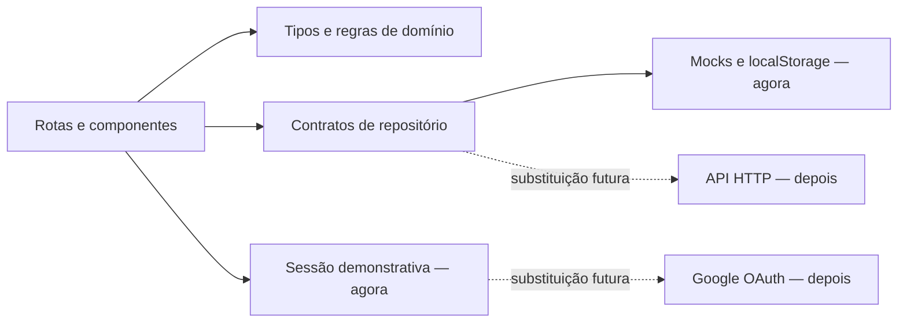

# Explora Computação — Plano e decisões de implementação

**Status:** protótipo implementado; manutenção incremental
**Versão:** 0.2
**Data:** 12 de agosto de 2026
**Especificação associada:** [`especificacao-plataforma.md`](../especificacao-plataforma.md)

## 1. Resultado esperado

Entregar um protótipo frontend responsivo e acessível que permita:

- conhecer a proposta na landing page;
- entrar diretamente no Acervo por uma sessão demonstrativa sem credenciais;
- buscar e filtrar o acervo;
- consultar o detalhe do único recurso inicial;
- favoritar recursos;
- criar pastas e organizar conteúdos;
- pesquisar e filtrar dentro de uma pasta;
- visualizar na navegação as áreas planejadas de perfil, planos e turmas, sem ativá-las nesta iteração.

O protótipo funciona localmente e no GitHub Pages e está preparado para receber backend, autenticação Google e IA em fases posteriores, sem implementar nenhuma dessas integrações agora.

## 2. Restrições da fase

- O frontend é estático e deve continuar publicável sem servidor próprio.
- Não haverá backend, API remota ou banco de dados.
- Não haverá OAuth real nem coleta de dados Google.
- Não haverá IA, fluxo de geração ou plano fictício.
- Usuários não podem cadastrar recursos.
- O catálogo inicial possui exatamente um recurso.
- A paleta oficial precisa ser confirmada porque não consta na versão atual do registro mestre.
- Imagens externas só entram no projeto com fonte, licença e crédito registrados.

## 3. Decisões de implementação

| ID | Status | Decisão | Motivo e consequência |
|---|---|---|---|
| D-001 | Aceita | **React + TypeScript + Vite** para a SPA. | Entrega rápida, build estático e baixo acoplamento ao backend futuro. SSR não é necessário para validar o fluxo do TCC. |
| D-002 | Aceita | **TypeScript em modo `strict`**. | O modelo curricular tem muitos campos e estados pendentes; tipos reduzem inconsistências. |
| D-003 | Revisada | **React Router com HashRouter** para navegação e parâmetros de busca. | Detalhes e pastas têm URLs compartilháveis, e o hash evita 404 ao recarregar rotas no GitHub Pages. |
| D-004 | Aceita | **Zustand com persistência em `localStorage`** para sessão demonstrativa e biblioteca pessoal. | Mantém o estado simples, testável e persistente sem criar API falsa. O store será versionado para permitir migração. |
| D-005 | Aceita | **Camada de repositório tipada** entre UI e mocks. | Componentes consomem contratos, não arquivos de dados; a implementação local poderá ser trocada por HTTP depois. |
| D-006 | Aceita | **CSS Modules + arquivo global de design tokens**. | Mantém identidade própria, estilos encapsulados e poucas dependências. |
| D-007 | Revisada | **Primitiva local de diálogo acessível**, sem biblioteca de UI obrigatória. | Mantém foco, teclado e semântica sob teste e reduz dependências sem impor visual genérico. |
| D-008 | Aceita | **Lucide React** para ícones de interface. | Ícones consistentes, leves e com boa integração semântica. O símbolo da marca permanece um asset próprio. |
| D-009 | Aceita | Detalhe do recurso em **rota própria**, não em modal grande. | Melhora acessibilidade, mobile, links diretos e uso do histórico; o visual ainda pode lembrar um painel expandido. |
| D-010 | Aceita | Busca e filtros ficam na **URL**. | Permite retorno preservando o contexto, testes determinísticos e futura vinculação/compartilhamento. |
| D-011 | Aceita | **Favoritos é uma pasta virtual derivada**, não uma pasta comum duplicada. | Evita divergência entre botão favoritar e lista de Favoritos. |
| D-012 | Aceita | **Adicionar a pasta não favorita automaticamente**. | Mantém as duas intenções distintas e previsíveis. |
| D-013 | Revisada | **Entrar** cria diretamente a sessão local e abre o Acervo; o modal e a integração Google ficam adiados. | Reduz etapas no protótipo sem coletar credenciais nem simular a interface de um provedor ainda não integrado. |
| D-014 | Aceita | **Sem API mock via rede** nesta fase. | Uma camada assíncrona de repositório local é suficiente; MSW pode ser adicionado quando houver contrato HTTP. |
| D-015 | Aceita | Dados curriculares têm **estado de validação**. | A interface não inventa metadados nem confunde dado ausente com dado negativo. |
| D-016 | Aceita | Recursos externos são inicialmente **referenciados por link**. | Evita cópia indevida enquanto o modelo híbrido e as licenças não forem definidos. |
| D-017 | Provisória | Usar a paleta descrita na spec, derivada da nova marca. | Permite iniciar o protótipo; os tokens centralizados tornam a troca barata quando a paleta oficial for informada. |
| D-018 | Aceita | Meta de **WCAG 2.2 AA** e automação com axe-core. | Acessibilidade entra no desenho e nos testes, não apenas na revisão final. |
| D-019 | Aceita | **Vitest + React Testing Library + Playwright**. | Cobre lógica de filtros/estado, componentes acessíveis e fluxos reais em múltiplas larguras. |
| D-020 | Aceita | **Sem analytics, cookies de rastreamento ou service worker** no primeiro protótipo. | Evita escopo e implicações de privacidade que não contribuem para a validação inicial. |
| D-021 | Aceita | **GitHub Actions + GitHub Pages** para CI/CD. | Cada publicação depende de tipos, lint, testes, build e E2E; somente `dist` é implantado. |
| D-022 | Aceita | **`VITE_BASE_PATH` + helper `publicAsset`**. | O mesmo código funciona na raiz local e no subdiretório do repositório no Pages. |
| D-023 | Aceita | **Referências visuais privadas fora do Git**. | Preserva materiais de processo localmente sem redistribuir arquivos com licença não comprovada. |

## 4. Arquitetura implementada

```text
.
  .github/workflows/       # validação e deploy automático
  config/                  # configurações das ferramentas
  docs/                    # produto, TCC, arquitetura e créditos
  public/                  # ativos distribuídos
  src/
    app/                   # composição de rotas
    components/            # elementos compartilhados e layout
    data/                  # catálogo inicial
    domain/                # tipos curriculares, recursos e pastas
    features/              # about, catalog, folders e landing
    lib/                   # filtros e resolução de ativos
    repositories/          # contrato e implementação local do catálogo
    store/                 # sessão e biblioteca pessoal
    styles/                # tokens e globais
    test/                  # configuração comum
  tests/e2e/               # testes Playwright
```

### 4.1 Limites entre camadas



- `domain` não importa React, Zustand ou componentes.
- `data` contém fixtures, não regras de apresentação.
- os repositórios retornam `Promise`, mesmo localmente, para preservar o contrato futuro sem atrasos artificiais;
- o store de biblioteca guarda apenas IDs, nomes de pastas e versão do schema;
- parâmetros de busca/filtro são derivados da URL, não duplicados como segunda fonte de verdade global.

### 4.2 Contratos iniciais

```ts
interface CatalogRepository {
  list(): Promise<Resource[]>;
  getBySlug(slug: string): Promise<Resource | null>;
}

interface LibraryRepository {
  load(): Promise<LocalLibraryState>;
  save(state: LocalLibraryState): Promise<void>;
  clear(): Promise<void>;
}
```

Implementações atuais:

- `LocalCatalogRepository`: lê fixtures TypeScript imutáveis.
- persistência versionada do Zustand: serializa, valida e migra a biblioteca no `localStorage` nesta fase.

Implementações futuras, fora deste plano:

- `HttpCatalogRepository`.
- `HttpLibraryRepository`.
- `GoogleSessionProvider`.

## 5. Dados e estado local

### 5.1 Chaves sugeridas

| Chave | Conteúdo |
|---|---|
| `explora-computacao:session:v1` | Booleano/objeto mínimo indicando sessão de demonstração. |
| `explora-computacao:library:v1` | Favoritos, pastas e `schemaVersion`. |

Não armazenar nome, e-mail, foto, escola, dados de estudantes ou tokens.

### 5.2 Regras de integridade

- Ignorar IDs de recursos que não existam mais no catálogo.
- Recuperar com estado vazio quando o JSON estiver inválido.
- Validar `schemaVersion` antes de hidratar.
- Normalizar nomes de pasta antes de verificar duplicidade.
- Gerar IDs de pasta com `crypto.randomUUID()` quando disponível.
- Não permitir renomear/excluir Favoritos.
- Não duplicar o mesmo recurso dentro da mesma pasta.

## 6. Fases de implementação

### Fase 0 — Preparação de conteúdo e ativos

**Status:** parcialmente concluída.

Tarefas:

- [x] Consolidar requisitos na especificação.
- [x] Validar a habilidade `EF07CO09` na fonte oficial da BNCC Computação.
- [x] Gerar o símbolo provisório com fundo transparente.
- [x] Criar a imagem padrão de recurso em SVG.
- [x] Selecionar a fotografia CC0 do campus da UFSM.
- [ ] Confirmar ou substituir a paleta provisória e atualizar o registro mestre.
- [x] Baixar a fotografia selecionada para `public/images/hero-ufsm-campus-santa-maria.jpg` e registrar crédito no repositório.
- [x] Validar o arquivo, o recorte inicial e o texto alternativo da fotografia.
- [ ] Revisar com o autor os textos provisórios da landing page.
- [ ] Confirmar os campos de curadoria ainda pendentes do jogo.

**Observação operacional:** em 9 de agosto de 2026, o download pelo servidor de mídia da Wikimedia recebeu HTTP 429. A aquisição foi concluída depois, mantendo a licença CC0 confirmada na página do Wikimedia Commons e a proveniência em `docs/creditos-e-licencas.md`.

**Gate:** ativos locais com procedência e tokens visuais aprovados ou explicitamente aceitos como provisórios.

### Fase 1 — Fundação técnica

Tarefas:

- [x] Criar projeto Vite React/TypeScript.
- [x] Ativar TypeScript `strict` e ESLint; não adicionar formatador separado nesta fase.
- [x] Instalar React Router, Zustand e Lucide.
- [x] Configurar Vitest, Testing Library e Playwright.
- [x] Criar aliases de importação e estrutura de pastas.
- [x] Configurar `tokens.css`, reset mínimo e estilos globais.
- [x] Definir scripts `dev`, `build`, `typecheck`, `lint`, `test` e `test:e2e`.
- [x] Criar rota 404; adicionar error boundary quando houver tratamento de falhas remotas.

**Gate:** aplicação vazia abre, build de produção e suíte inicial passam.

### Fase 2 — Sistema visual e componentes-base

Tarefas:

- [x] Integrar símbolo e imagem padrão.
- [x] Empacotar Inter e Source Serif 4 com fallback adequado.
- [ ] Criar `Button`, `IconButton`, `TextField`, `Badge`, `Card`, `Dialog`, `Select/Combobox`, `EmptyState`, `Skeleton` e `Toast/LiveRegion`.
- [x] Criar `SkipLink`, container editorial e utilitários de foco.
- [ ] Documentar variantes e estados em uma rota interna de desenvolvimento ou testes de componente.
- [x] Validar contraste dos tokens.

**Gate:** componentes operáveis por teclado, com estados de foco, erro, desabilitado e carregamento cobertos por testes.

### Fase 3 — Landing page pública

Tarefas:

- [x] Implementar cabeçalho responsivo e links âncora.
- [x] Implementar hero com overlay e recorte responsivo.
- [x] Implementar problema/objetivos.
- [x] Implementar seção narrativa do acervo.
- [x] Implementar seção de planos contextualizados sem executar geração por IA.
- [x] Implementar rodapé com crédito da fotografia.
- [x] Adicionar metadados de página, título e descrição.
- [x] Validar rolagem, foco dos links âncora e redução de movimento.

**Gate:** critérios `LAND-*` da especificação atendidos em 375, 768 e 1440 px.

### Fase 4 — Entrada demonstrativa e shell autenticado

Tarefas:

- [x] Implementar entrada demonstrativa direta no Acervo, sem diálogo intermediário.
- [x] Adiar modal e autenticação Google para a etapa de identidade real.
- [x] Criar store de sessão e proteção das rotas `/app/*`.
- [x] Redirecionar acessos internos sem sessão para a landing, sem abrir o fluxo futuro de autenticação.
- [x] Implementar sidebar com os oito itens definidos; manter **Meu perfil**, **Meus Planos de Aula**, **Criar Plano de Aula** e **Minhas Turmas** inativos.
- [x] Implementar barra superior e drawer mobile.
- [x] Implementar **Sair** sem apagar a biblioteca pessoal.

**Gate:** usuário entra sem informar dados, chega ao Acervo, navega só por teclado e sai com comportamento previsível.

### Fase 5 — Domínio, fixture e Acervo

Tarefas:

- [x] Implementar tipos de currículo e recurso.
- [x] Cadastrar somente `altinovare-cyberbullying` com proveniência e estados pendentes.
- [x] Implementar `CatalogRepository` e versão local.
- [x] Implementar normalização de busca sem acento e sem diferença de caixa.
- [x] Implementar combinação de busca, Turma e Habilidade.
- [x] Sincronizar parâmetros com a URL.
- [x] Criar card com e sem imagem.
- [x] Criar contagem, chips ativos, limpeza e estados vazio/sem resultado.
- [x] Garantir que não exista ação de publicação.

**Gate:** critérios `CAT-*` atendidos e funções de filtro cobertas por testes unitários.

### Fase 6 — Detalhe do recurso

Tarefas:

- [x] Criar rota e breadcrumb.
- [x] Implementar cabeçalho, imagem padrão e metadados.
- [x] Implementar seções progressivas do detalhe.
- [x] Diferenciar visual e semanticamente dados validados, pendentes e não informados.
- [x] Implementar confirmação/aviso para acesso externo.
- [x] Preservar filtros ao retornar ao Acervo.
- [x] Preparar ações de Favoritar e Adicionar à pasta para a fase seguinte.

**Gate:** critérios `DET-*` atendidos; detalhe útil mesmo com metadados incompletos.

### Fase 7 — Favoritos e pastas

Tarefas:

- [ ] Implementar store versionado e repositório de biblioteca local.
- [x] Implementar favoritar/desfavoritar no card e no detalhe.
- [x] Derivar a pasta virtual Favoritos.
- [x] Implementar lista e estados vazios de Meus Materiais.
- [x] Implementar criação, validação e normalização de nomes.
- [x] Implementar diálogo para selecionar múltiplas pastas.
- [x] Permitir criar pasta sem abandonar o fluxo de inclusão.
- [x] Implementar remoção de recurso de pasta.
- [x] Reutilizar busca/filtros dentro da pasta.
- [x] Implementar limpeza confirmada dos dados da demonstração.

**Gate:** fluxo E2E cria “Turma sétimo ano — Escola Lívia Menna Barreto”, adiciona o jogo, filtra dentro dela e preserva tudo após recarga.

### Fase 8 — Itens futuros da navegação

Tarefas:

- [x] Manter **Meu perfil** visível e inativo, sem exibir dados pessoais fictícios.
- [x] Manter **Meus Planos de Aula** e **Criar Plano de Aula** visíveis e inativos.
- [x] Adicionar **Minhas Turmas** como item inativo.
- [x] Confirmar que os itens inativos não alteram a URL e que não há formulário, saída gerada ou chamada externa.

**Gate:** rotas estão completas e não ultrapassam o escopo declarado.

### Fase 9 — Qualidade, acessibilidade e entrega

Tarefas:

- [x] Executar checagem de tipos, lint, testes unitários e de componentes.
- [ ] Executar fluxos Playwright em Chromium, Firefox e WebKit quando disponíveis.
- [x] Rodar axe-core nas páginas principais.
- [ ] Validar zoom de 200%, reflow, teclado e leitor de tela em amostra manual.
- [ ] Fazer regressão visual em 375, 768 e 1440 px.
- [ ] Otimizar hero para formatos/tamanhos responsivos e evitar CLS.
- [x] Validar links, `noopener noreferrer`, estados de erro e 404.
- [ ] Revisar textos, ortografia, fontes curriculares, créditos e licenças.
- [x] Documentar execução local e build.

**Gate:** definição de pronto atendida.

## 7. Estratégia de testes

### 7.1 Unitários

- Normalização de acentos e caixa na busca.
- Pesquisa em título, resumo, TAGs e habilidade.
- União dentro de um filtro e interseção entre filtros.
- Serialização e leitura segura dos parâmetros da URL.
- Favoritar/desfavoritar e derivação de Favoritos.
- Criação de pasta, duplicidade normalizada e limites do nome.
- Inclusão/remoção sem duplicidade.
- Hidratação, corrupção e migração do `localStorage`.
- Exibição de metadados curriculares pendentes.

### 7.2 Componentes

- Entrada demonstrativa abre o Acervo diretamente e transfere o foco ao conteúdo principal.
- Card funciona com imagem, sem imagem e com dados pendentes.
- Filtros têm labels e são operáveis por teclado.
- Contagem e confirmações chegam à região `aria-live`.
- Diálogo de pastas mantém o estado ao criar nova pasta.
- Sidebar/drawer anuncia a rota atual.

### 7.3 Ponta a ponta

1. Abrir a landing, percorrer as seções e chegar ao rodapé.
2. Selecionar **Entrar** e confirmar que o primeiro destino é o Acervo, sem diálogo intermediário.
3. Confirmar que **Criar Plano de Aula** e **Minhas Turmas** estão inativos e não alteram a URL.
4. Buscar por “cyberbullying” e filtrar por 7º ano e `EF07CO09`.
5. Abrir o detalhe e voltar com os filtros preservados.
6. Favoritar e localizar o item em Favoritos.
7. Criar a pasta de exemplo e adicionar o item.
8. Buscar e filtrar dentro da pasta.
9. Recarregar e confirmar persistência.
10. Sair e confirmar bloqueio das rotas internas.
11. Entrar novamente e confirmar que a biblioteca foi preservada.
12. Confirmar que os demais itens futuros permanecem visíveis e inativos.

## 8. Orçamento de qualidade

- Zero erros de TypeScript, lint e testes no pipeline local.
- Zero violações críticas ou sérias do axe-core nos fluxos cobertos.
- Sem rolagem horizontal em 320 px.
- Alvos interativos de pelo menos 44 × 44 px.
- Imagens com dimensões reservadas e hero otimizado.
- Meta orientativa de Lighthouse em build: pelo menos 90 em Acessibilidade, Boas Práticas e SEO; quedas devem ser explicadas, não mascaradas.
- Suporte às duas versões estáveis mais recentes de Chrome, Edge, Firefox e Safari no momento da implementação.

## 9. Riscos e mitigação

| Risco | Impacto | Mitigação |
|---|---|---|
| Paleta citada, mas ausente do registro mestre | Retrabalho visual | Tokens centralizados e confirmação antes do polimento final. |
| Fotografia externa indisponível ou alterada | Hero sem ativo | Registrar fonte CC0, manter fallback cromático e armazenar cópia local autorizada. |
| Classificação curricular inconsistente | Perda de credibilidade | Textos oficiais com código, fonte e estado de validação; já validado `EF07CO09`. |
| Licença do jogo ou da miniatura desconhecida | Uso indevido de imagem | Apenas link externo e placeholder próprio até confirmação. |
| `localStorage` corrompido ou incompatível | Perda do estado demonstrativo | Schema versionado, validação e recuperação para estado vazio. |
| Interface superdimensionada para um único item | Sensação artificial | Manter arquitetura real, mas estados e textos honestos sobre o corpus inicial. |
| Entrada demonstrativa interpretada como autenticação real | Expectativa incorreta sobre identidade e persistência | Não exibir marca ou credenciais Google; documentar a sessão local e adiar o modal até a integração real. |
| Seção de IA sugerir funcionalidade ativa | Divergência de escopo | Manter os itens de planejamento inativos até que o fluxo seja especificado e implementado. |
| Sidebar e filtros ocuparem espaço excessivo em mobile | Fluxo difícil | Drawer e painel de filtros, com conteúdo em uma coluna. |
| Pastas e filtros implementados separadamente | Bugs e duplicação | Reutilizar o mesmo `CatalogView` e o mesmo motor de filtros por escopo. |

## 10. Preparação para backend futuro

As decisões desta fase não escolhem tecnologia de backend. Elas apenas mantêm pontos de substituição claros:

| Agora | Futuro possível |
|---|---|
| `LocalCatalogRepository` | `HttpCatalogRepository` com paginação e filtros no servidor. |
| `LocalLibraryRepository` | Biblioteca vinculada ao usuário em API/banco. |
| `useSessionStore` demonstrativo | Provider OAuth Google e sessão segura no servidor. |
| Fixture TypeScript | Registros curados em banco com histórico e auditoria. |
| Busca local | Índice de busca ou consulta facetada. |
| Itens de planos e turmas inativos | Módulos definidos em especificações próprias antes de habilitar a navegação. |

Antes da migração:

- definir autenticação, autorização e perfis;
- criar contrato de API versionado;
- decidir paginação, ordenação e filtros no servidor;
- migrar dados locais com consentimento ou oferecer exportação;
- definir governança de curadoria e verificação de links;
- fazer análise de privacidade/LGPD;
- especificar a arquitetura de IA separadamente, incluindo proveniência, avaliação e custos.

## 11. Itens deliberadamente adiados

- Mais filtros: formato, metodologia, duração, infraestrutura, licença e acessibilidade.
- Comparação de recursos.
- Coleção temporária para montar uma aula.
- Explicação “por que este recurso combina com sua busca”.
- Exportação com referências.
- Compartilhamento de pastas.
- Comentários e avaliações moderadas.
- Painel de cobertura do acervo.
- Verificação automatizada de links.
- Área de curadoria/administração.
- Backend, login Google, IA e plano de estudo.

Esses itens não devem entrar incidentalmente na primeira implementação.

## 12. Definição de pronto

O protótipo está pronto quando:

- todos os critérios de aceite da especificação estão atendidos;
- somente o recurso inicial aprovado está no Acervo;
- landing, entrada, Acervo, detalhe, Favoritos, pastas e Sobre funcionam; itens futuros permanecem desabilitados;
- busca e filtros funcionam no Acervo e dentro de pastas;
- o estado persiste depois de recarregar;
- não existe upload, backend, autenticação real ou IA;
- os fluxos principais funcionam em teclado e mobile;
- TypeScript, lint, testes e build passam;
- não há violações críticas ou sérias de acessibilidade nos fluxos automatizados;
- o workflow publica somente depois das verificações e o site carrega no subdiretório do GitHub Pages;
- fontes curriculares, créditos e licenças estão documentados;
- o README explica como instalar, executar, testar e gerar o build;
- qualquer decisão ainda provisória aparece explicitamente no registro mestre ou na documentação de entrega.
